# 开票

by: Amy Peng

## 开销售订单

(1). 进入主页面选择 “销售”模块

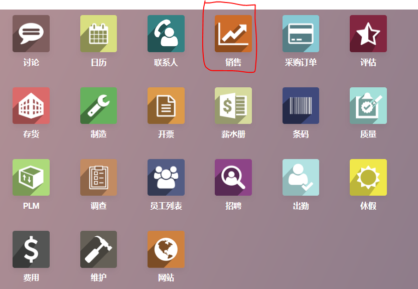

(2). 选择 销售---销售订单

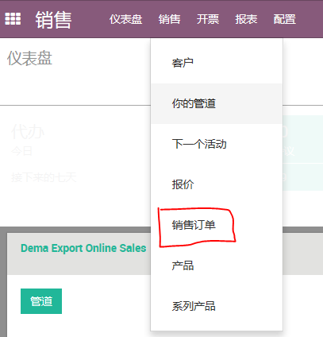

(3). 点击创建—创建新的订单信息

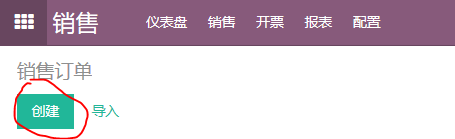

(4). 信息录入完成后，保存，然后点击CONFIRM SALE，完成

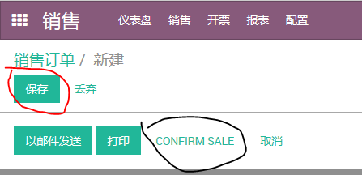

## 开销售发票

(1). 进入主页面选择“开票”模块

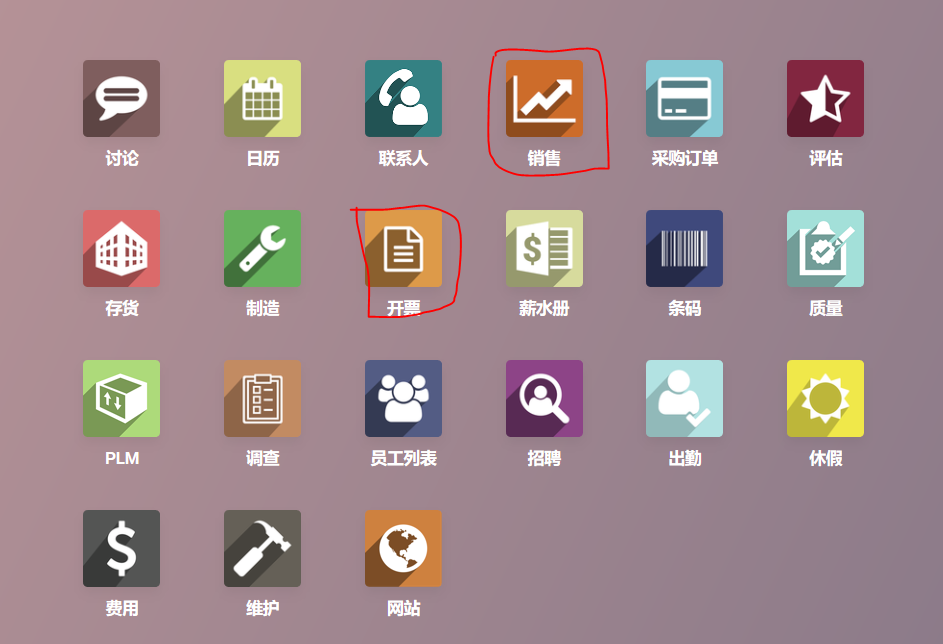

(2). 进入“销售订单“模块，点”销售“—”销售订单“ ，可在右边红色圈位置输入需要开票的PO订单号码

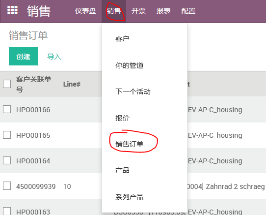

(3). 3.	可以在搜索栏输入需要开票的销售订单号码，点击搜索到的订单 –点击“创建发票”后会出现“开票订单”选择页面，一般我们会按实际情况选择前三项中的一项即可，点击“创建和查看发票”，按出库单录入准确的信息，开票日期为出货日期，注意红色部份必须填写准确，然后“保存“—”验证“，将发票号码注明在出库单上。（以下页面按实际操作顺序）

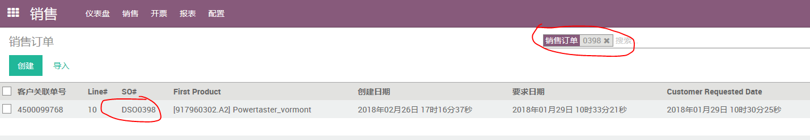

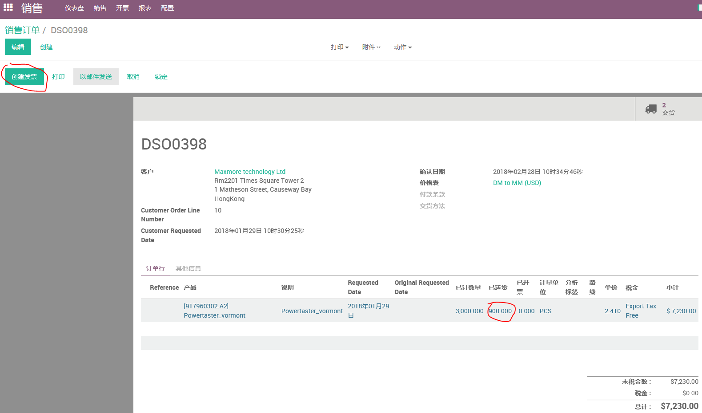

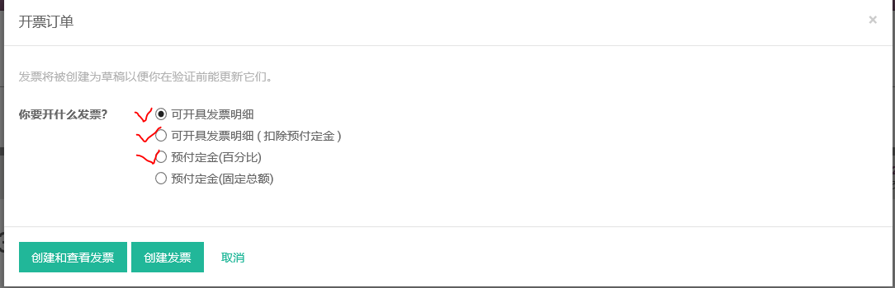

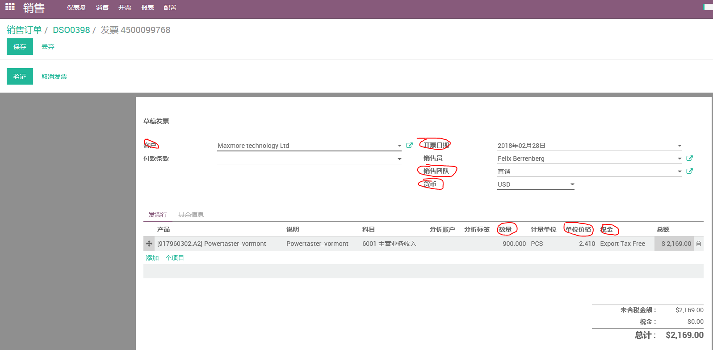

## 退货发票开具

(1). 进入主页面选择“采购订单”—“采购”，输入退货的DPO订单号码

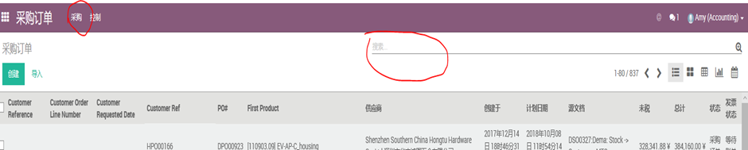

(2). 点击搜索到的订单号码—“右上角”供应商账单“—选择可退货的发票号码---“要求退款”

(3). 正常退货请选择“创建草稿退货”，填写完整退货信息后点击“创建退款”，创建完成后点击“编辑”，录入正确的退货数据—“保存”—“验证”生成R开头的发票，完成。

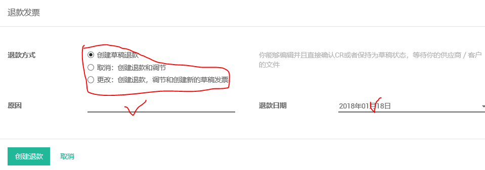

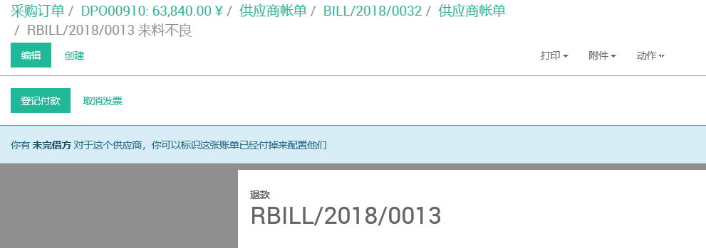

## 供应商账单开具

(1) 进入主页面选择“采购订单”—“采购”，输入采购单DPO号码

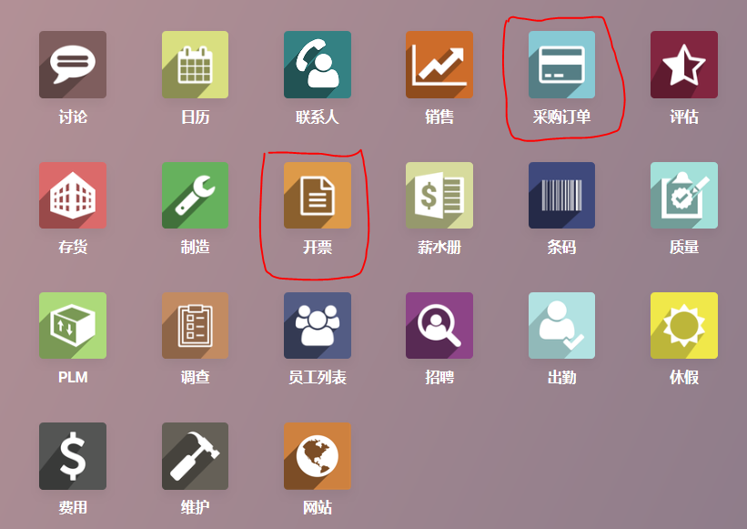

(2) 点击搜索到的订单号码—右上角“供应商账单”---“创建”

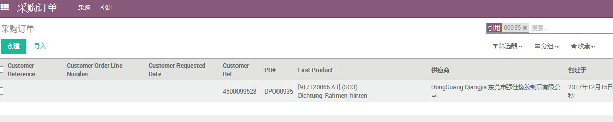

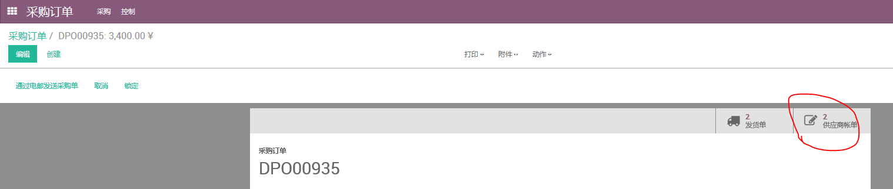

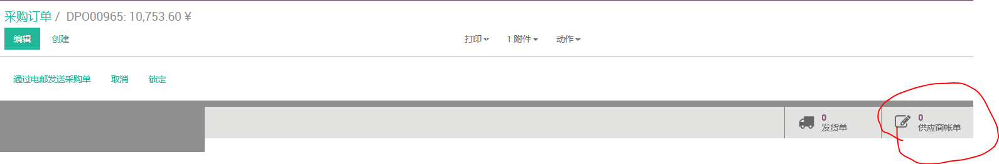

(3) 填写并核对红色部份信息—“保存”---“验证”，完成

## 收款及消账

(1) 收款，进入主页面选择“开票”—“销售”---“付款”—“创建”

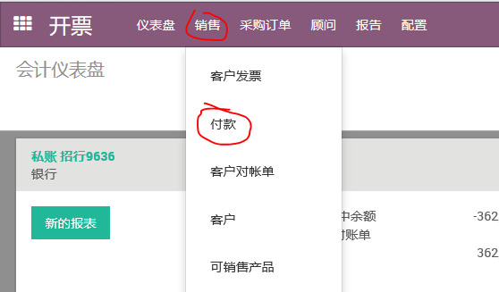

(2) 消账，进入主页面先择“开票”模块，销售---“更多”---“匹配付款”，选择需要的信息后按“调整”后自动生成冲账分录

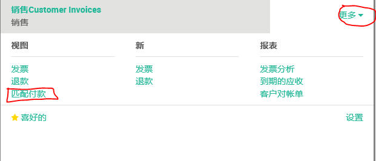

(3)