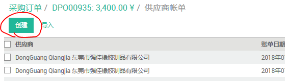

# 开票

by: Amy Peng

## 开销售订单

(1). 进入主页面选择 “销售”模块

(2). 选择 销售---销售订单

(3). 点击创建—创建新的订单信息

(4). 信息录入完成后，保存，然后点击CONFIRM SALE，完成

## 开销售发票

(1). 进入主页面选择“采购订单”或者“开票”模块  二者都可

(2). 进入“采购订单“模块，点”采购“—”采购订单“ ，可在右边红色圈位置输入需要开票的PO订单号码

(3). 点击搜索到的DPO –点击红色“供应商账单“---“创建”—“保存“—”验证“，完成

## 退货发票开具

(1). 进入主页面选择“采购订单”—“采购”，输入退货的DPO订单号码

(2). 点击搜索到的订单号码—“右上角”供应商账单“—选择可退货的发票号码---“要求退款”

(3). 正常退货请选择“创建草稿退货”，填写完整退货信息后点击“创建退款”，创建完成后点击“编辑”，录入正确的退货数据—“保存”—“验证”生成R开头的发票，完成。

