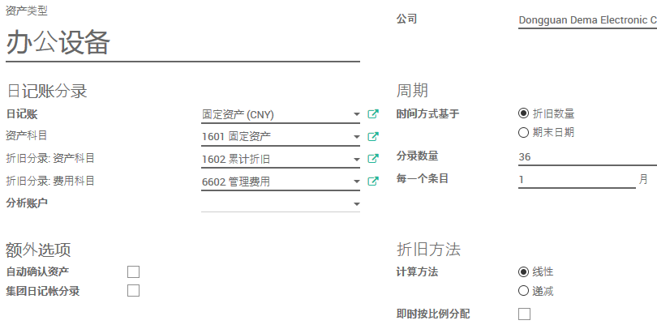

# 固定资产管理

## 资产类型

路径：开票模块 -> 配置 -> 资产类型

点击`创建`以新建资产类型

* 输入资产类别名称

* 选择`日记账`，通常为`固定资产(CNY)`
* 选择`资产科目`，通常为`1601 固定资产`
* 选择`折旧分录：资产科目`，通常为`1602 累计折旧`
* 选择`折旧分录：费用科目`，根据费用情况选择

* `自动确认资产`：如果选中，则发票创建时自动确认此类别的资产
* `集团日记账分录`：（实际应翻译为分组日记账分录）如果选中，则按类别分组生成分录

* `时间方式基于`
  * `折旧数量`：通过`分录数量`和分录频率(多久产生一项分录)来设定折旧（建议选项）
  * `期末日期`：通过`结束日期`和分录频率(多久产生一项分录)来设定折旧

* (折旧)`计数方法`
  * `线性`，每期折旧金额相同（建议选项）
  * `递减`，每期折旧金额按一定比率递减

## 资产

路径：开票模块 -> 顾问 -> 资产

点击`创建`以新建资产

* 输入资产名称
* 选择资产类别（参考前文）
* 在参照栏输入资产编号
* 输入资产确认日期
* 选择币种
* 选择资产所属公司
* 输入资产毛值
* 输入资产的剩余价值（折旧后的余额）
* 输入资产的残余价值（待折旧金额）
* 选择资产的供应商
* 录入发票号码

若需要登记旧资产（已折旧一定期数），建议：

* 毛值设为当前的参与价值
* 折旧数量设为剩余折旧期数

## 确认资产

固定资产信息输入完成后，需要`确认`资产。

点击资产页面的确认按钮，可以确认资产。

对于`自动确认资产`类别的资产，可在供应商账单上选择`资产类别`

账单一旦被确认，则该资产被自动确认

(请注意，这种情况下，`剩余价值`自动设为0.00，可能不符合国内会计规则。)

## 折旧

* 在`资产`页面的`折旧板`中，点击折旧项右侧的红色原点，可以产生折旧的日记账分录。
* 点击后，红色圆点变成橙色，点击资产页面右上角的项目按钮可以找到相应的日记账分录。
* 该日记账分录处于`未过账`状态，点击`记账`按钮可以进行过账。
* 对于`自动确认资产`类别的资产，过账是自动的。

