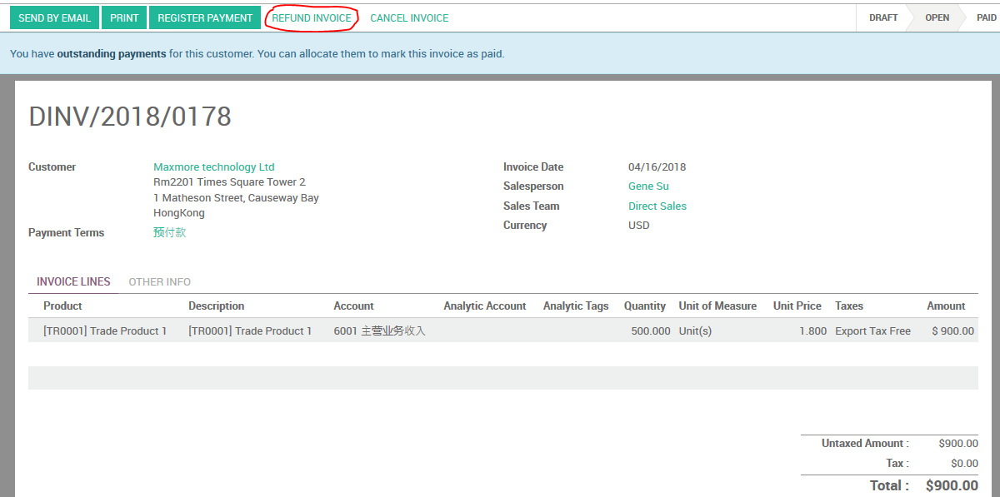
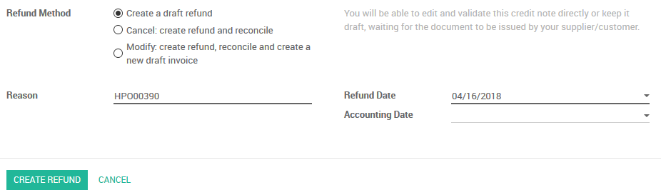
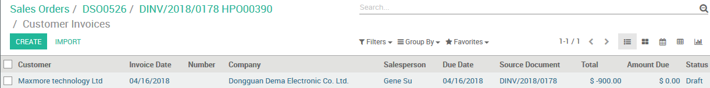
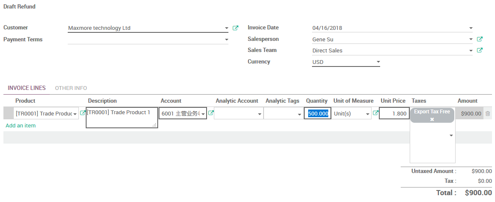
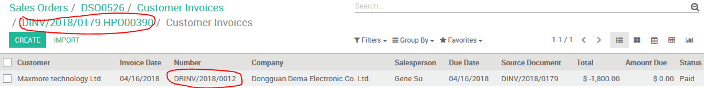
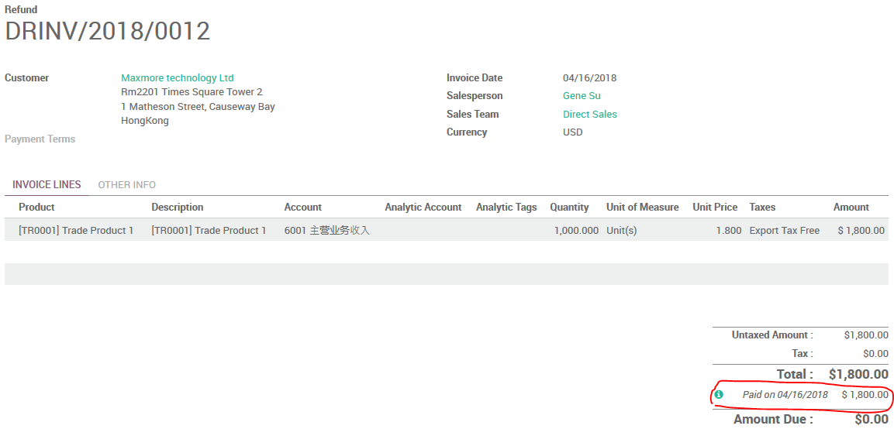
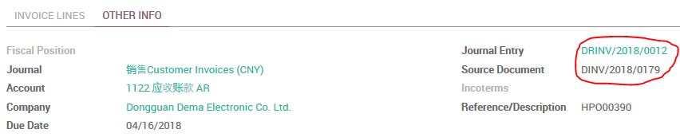
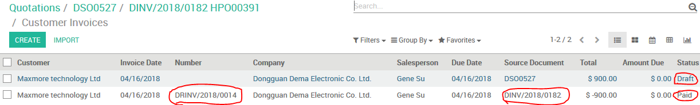
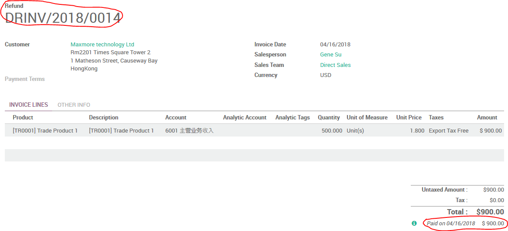
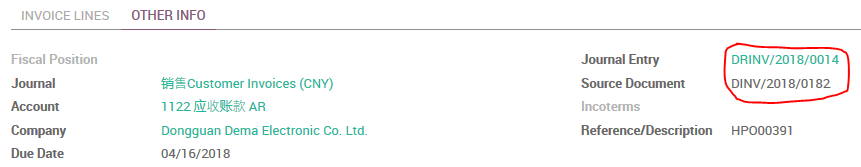

# 客户退款

(1) 打开客户发票，点击“REFUND INVOICE”

(2) 选择处理方式

* `Create a draft refund` (`创建草稿退款`)
  * You will be able to edit and validate this credit note directly or keep it draft, waiting for the document to be issued by your supplier/customer.
  * 您将能够直接编辑和验证这张信用卡，或保持其为草稿，以等待您的供应商/客户先发出文件。
* `Cancel: create refund and reconcile` (`取消：创建退款和调节`)
  * Use this option if you want to cancel an invoice you should not have issued. The credit note will be created, validated and reconciled with the invoice. You will not be able to modify the credit note.
  * 如果您想取消您不应该开具的发票，请使用此选项。信用证将由发票开具、验证和核对。您将无法修改信用记录。
* `Modify: create refund, reconcile and create a new draft invoice` (`更改：创建退款，调节和创建新的草稿发票`)
  * Use this option if you want to cancel an invoice and create a new one. The credit note will be created, validated and reconciled with the current invoice. A new, draft invoice will be created so that you can edit it.
  * 如果要取消发票并创建一个新发票，请使用此选项。信用证将与现行发票一起创建、验证和核对。一个新的草稿发票将被创建，这样你就可以编辑它。

(3.1) `Create a draft refund`

选择`Create a draft refund`并点击`CREATE REFUND`，系统会创建一张草稿状态的退款单。

* 若非整单退货，请修改数量。
* 选择正确的退货日期。(`Invoice Date`)
* 点击`VALIDATE`以确认退款单。

(3.2) `Cancel: create refund and reconcile`

选择`Cancel: create refund and reconcile`并点击`CREATE REFUND`，系统会创建一张退款单并直接与当前发票直接调节冲抵。

(若开具发票错误，这是最直接有效的取消方式！)

(3.3) `Modify: create refund, reconcile and create a new draft invoice`

选择`Modify: create refund, reconcile and create a new draft invoice`并点击`CREATE REFUND`，系统会创建一张退款单并直接与当前发票直接调节冲抵；而且，系统会另建一张草稿状态的发票，内容与当前发票相符，你可以根据情况编辑并保存，然后验证它。

