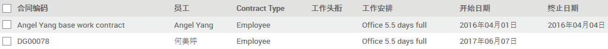
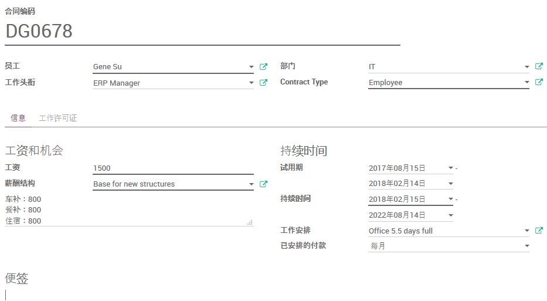

# 合同

## 新建合同

路径：员工列表模块 -> 合同

点击`创建`以新建一份合同。

* 录入`合同编码`
* 选择`员工`
* 选择雇员的`工作头衔`(职位)
* 指定雇员的`部门`
* 选择`Contract Type`(合同类型：Employee 职员，Worker 工人, Subcontractor 外包)

* 录入`工资`
* 选择`薪酬结构`
* 可在下方录入薪酬的说明性信息
* 录入`试用期`的起止日期
* 录入`持续时间`的起止日期
* `工作安排`统一选择`Office 5.5 days full`
* `已安排的付款`统一选择`每月`

* `便签`这里可以录入合同的备注性信息，比如附加条款等