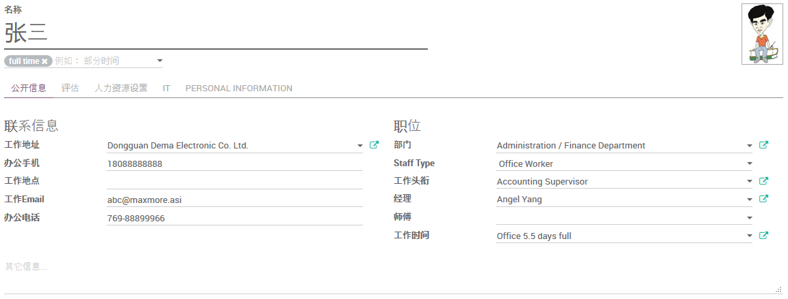
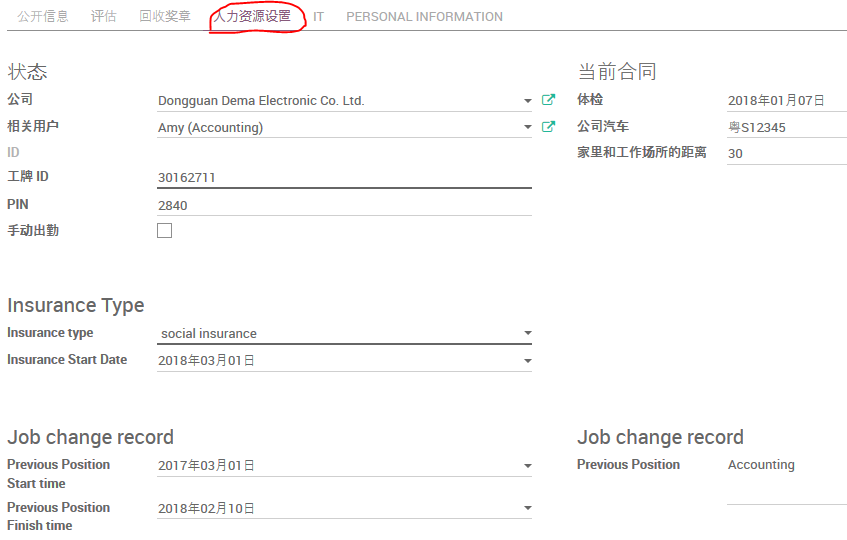
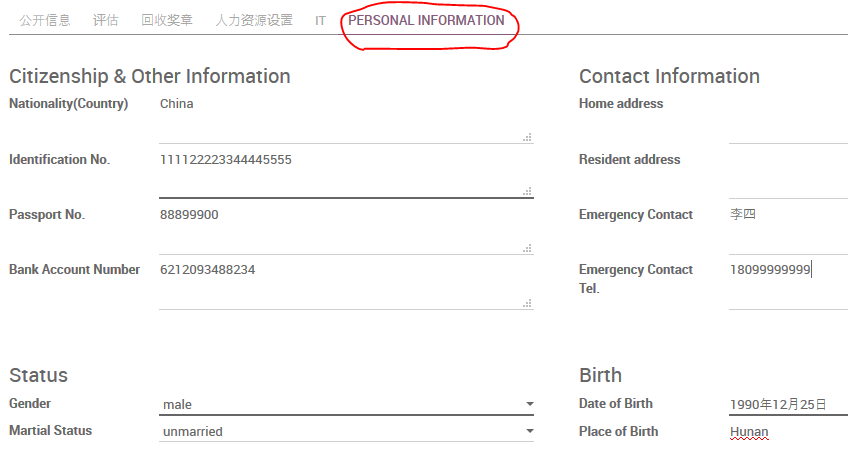

# 人事档案

点击`创建`以新建人事档案。

## 公开信息

* 录入雇员姓名
* 若`工作地址`不在公司默认地址，请另作选择
* 录入`办公手机`
* 录入详细的`工作地点`
* 录入`工作Email`
* 录入`办公电话`
* 选择该雇员的`部门`
* `Staff Type`分Office Worker(办公室职员)和Factory Worker(产线员工)
* `工作头衔`选择该雇员的职位
* `经理`选择该雇员的上司
* `工作时间`统一选择 `Office 5.5 days full`
* 表单下方可以填写与该雇员有关的详细说明信息

## 人力资源设置

* 若该雇员拥有Odoo用户，可在`相关用户`设定
* `工牌ID`记录该雇员佩戴的厂牌（印有照片、工号、部门）的磁卡的序列号
* `PIN`记录该雇员在考勤系统的ID（通常与其工号一致）
* 将该雇员最近一次体检日期录入`体检`栏
* 若该雇员分批了`公司汽车`，将车牌号录入此栏
* `家里和工作场所的距离`用以计算车旅费报销(根据合同)

* `Insurance type`设定该雇员的保险类型
* `Insurance Start Date`录入该雇员保险的开始日期

* `Previous Position Start time` 前一职位的开始时间
* `Previous Position Finish time` 前一职位的结束时间
* `Previous Position` 前一职位

## PERSONAL INFORMATION

* `Nationlity(Country)` 雇员的国籍
* `Identification No.` 雇员的身份证号码
* `Passport No.` 雇员护照号码
* `Bank Account Number` 雇员银行账号
* `Gender` 雇员性别
* `Martial Status` 雇员婚姻状况
* `Home Address` 雇员家庭地址
* `Resident address` 雇员居住地址
* `Emergency Contact` 雇员的紧急联系人
* `Emergency Contact Tel.` 雇员的紧急联系电话
* `Date of Birth` 雇员的生日
* `Place of Birth` 雇员的出生地