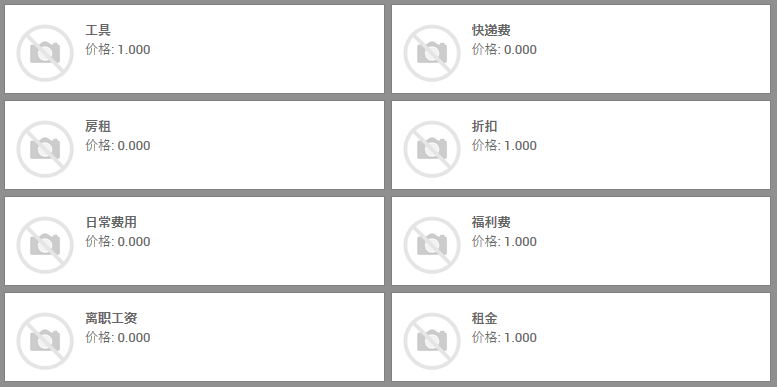
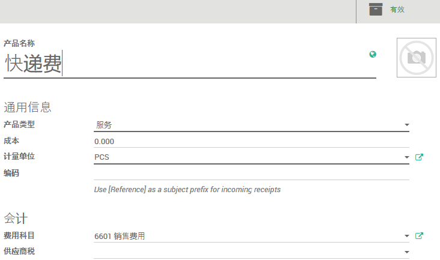
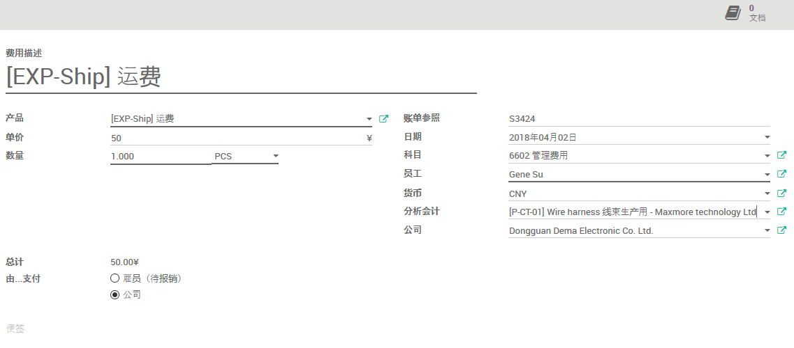
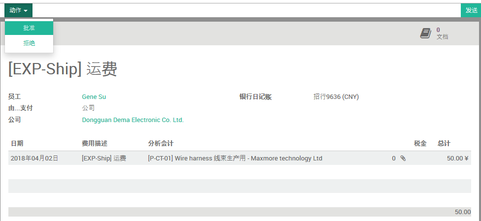
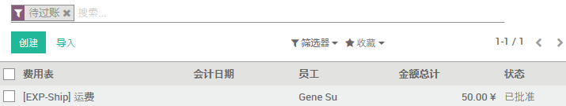
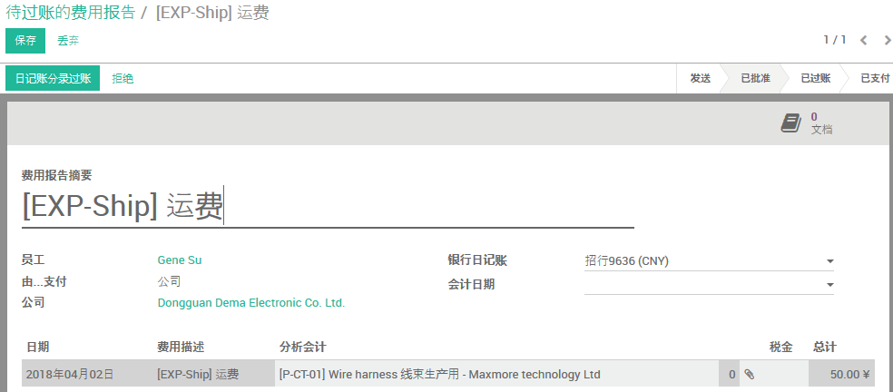
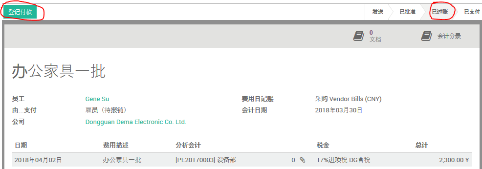
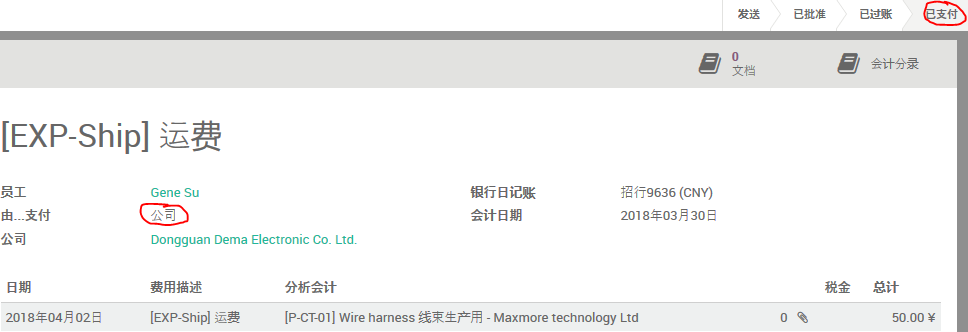
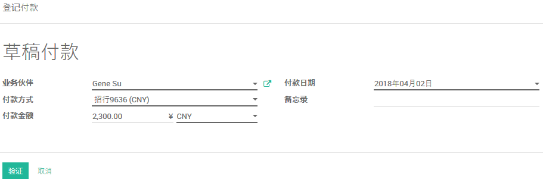

# 费用

## 费用产品

路径：费用模块 -> 配置 -> 费用产品

点击`创建`按钮以新建费用产品

* 录入`产品名称`
* `产品类型`选`服务`
* `成本`
  * 若单价固定，则录入单价
  * 若单价不定，则保持默认值，待申报费用时填写实际值
* 录入该项费用的`计量单位`
* 根据需要录入产品`编码`
* `费用科目`由会计部门填写
* 根据实际情况选填`供应商税`

## 填报费用

路径：费用模块 -> 我的费用 -> 待提交的费用

点击`创建`按钮，以填报费用

* 选择适当的费用`产品`
  * `费用描述`会根据所选产品而自动填充，可根据需要做适当修改
* 填写`数量`和`单价`
* `总计`会自动计算
* `由...支付`
  * `雇员(待报销)`，若雇员垫付费用，选此项
  * `公司`，若由公司直接支付（现金、转账），选此项
* `账单参照`用以填写相关收据或发票编号
* 选择费用产生的实际`日期`
* `科目`会根据所选产品自动设定，若有不适用，可改选
* 若替他人填报，请再`员工`栏选择当事人
* 选择费用的`货币`
* `分析会计`用以对应费用所属项目
* 可以点击`文档`按钮以添加附件（发票、收据、发货单、报价单等）
* 点击`保存`及`提交给经理`

## 审核费用

路径：费用模块 -> 待批准 -> 待批准的费用报告

* 认真复核各项信息，并根据公司报销制度判定合理性
* 若由公司支付，选择正确的`银行日记账`(通常对应不同的银行账户)
* 点击`动作`按钮做出相应判定

## 费用过账

路径：费用模块 -> 会计师 -> 待过账的费用报告

* 核实`银行日记账`
* 选择正确的`会计日期`
* 点击`日记账分录过账`
  * 由雇员垫支的费用，过账会使单价处于“已过账”状态。
  * 由公司支付的费用，应在实际支付完成后才“过账”。过账会使费用单处于“已支付”状态。

## 支付费用

路径：费用模块 -> 会计师 -> 待支付的费用报告

点击`登记付款`

* 选择`付款方式`
* 点击`验证`按钮以完成付款登记