# 休假

## 休假类型

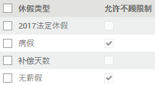

路径：休假模块 -> 配置

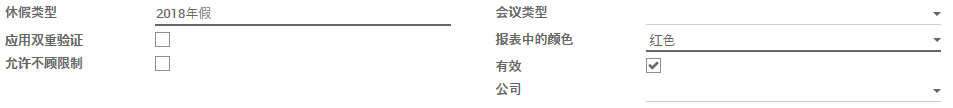

* 录入`休假类型`
* `应用双重验证`用以双重审批
* `允许不顾限制`雇员可以请求跟多的分配给他的此类型假期
* `会议类型`
* `报表中的颜色`打印的报表中显示的颜色
* `公司`留空则适用于所有公司

## 假期配置

路径：休假模块 -> 待批准请假 -> 假期配置

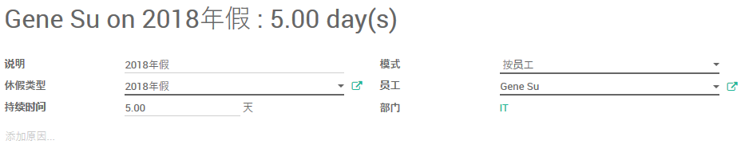

* 录入假期`说明`
* 选择`休假类型`
* 录入`持续时间`
* 选择假期配置`模式`为`按员工`
* 选择该假期配置的`员工`
* 如需进一步说明，可在下方录入
* 假期配置需要`批准`方能生效

## 请假

路径：休假模块 -> 我的准假 -> 请假需求

在日历中按下鼠标并拖动，选择请假的日期范围。当松开鼠标时，`请假需求`窗口会弹出。

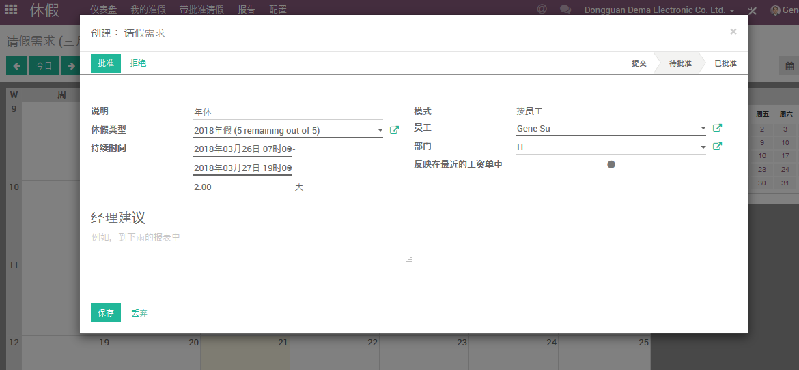

* 录入请假`说明`
* 选择请假的`员工`
* 选择`休假类型`
* 录入请假的`持续时间`

## 批假

路径：休假模块 -> 待批准请假 -> 休假

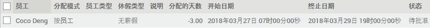

若需要跨部门审批（比如总经理审批），请从过滤器中清除“我部门的休假”。

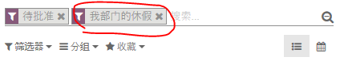

打开要审批的休假申请。

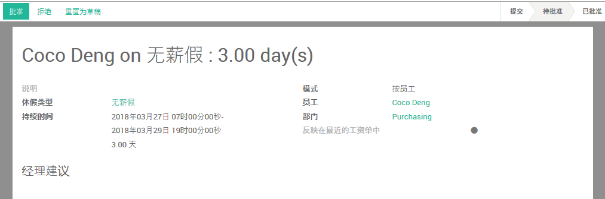

`批准`或`拒绝`之前可以将回复信息录入`经理建议`。

## 休假报告

路径：休假模块 -> 报告

### 请假详细描述

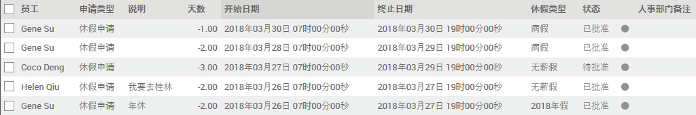

### 休假分析

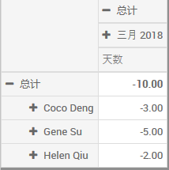

### 休假（按部门）

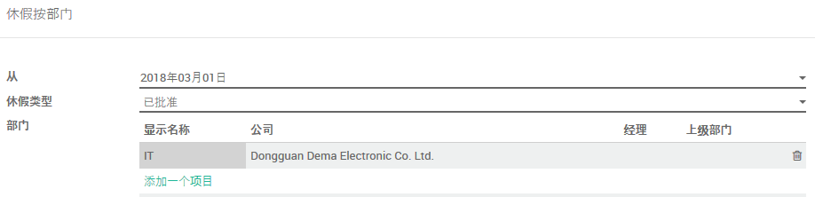

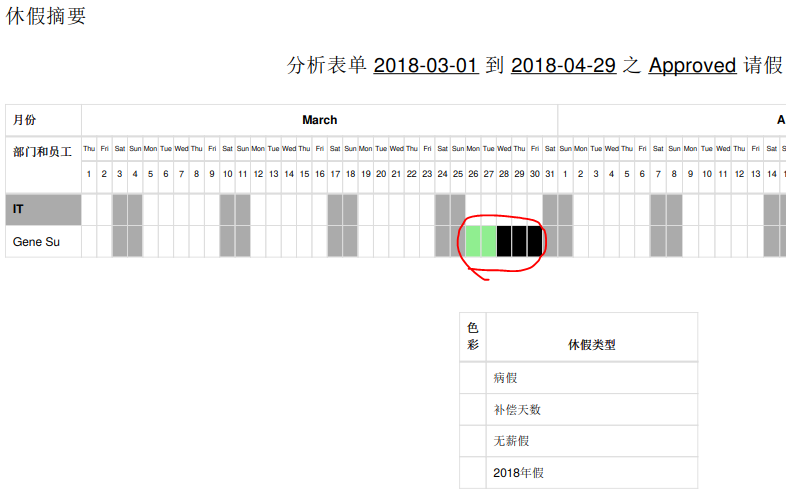