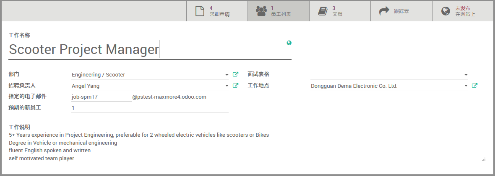

# 职位

路径：招聘模块 -> 配置 -> 工作岗位

点击`创建`以新建`职位`。

* 输入`工作名称`
* 选择该职位所属`部门`
* 指定`招聘负责人`
* 输入`指定的电子邮件`
* 输入`预期的新员工`
* 为该职位指定适当的`面试表格`
* 若`工作地点`不在公司默认地址，请做适当选择
* 输入详细的`工作说明`

该职位收到的`求职申请`和当前员工可以很便利地在页面上部找到。

