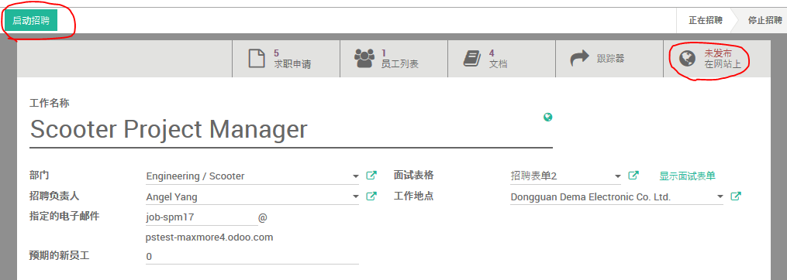

# 招聘

## 一般设定

路径： 招聘模块 -> 配置

本设定决定是否在招聘过程中使用面试表格。

## 招聘表格

招聘表格是一种[调查](survey.md)表格，可在`调查`模块进行维护。

每个岗位的招聘可以指定单独的`招聘表格`,因此可以根据需要创建多个`招聘表格`,以适用于不同目标人群。

## [部门](department.md)

## [职位](job.md)

## 启动招聘

* 当职位有空缺，需要招聘新人时，在职位页面的左上角点击`启动招聘`按钮，以启动该职位的招聘。
* 点击职位页面右上角的`发布在网站上`可以将招聘信息公开发布到网站上。

* 点击红色的`Unpublished`按钮以发布该职位招聘信息，然后按钮会变成绿色的`Published`按钮。

