# 车队

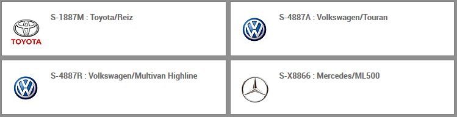

## 汽车

路径：车队模块 -> 汽车

点击`新建`以登记车辆。

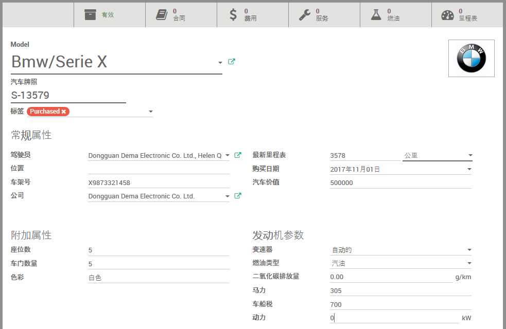

* 在`Model`选择/录入汽车的品牌/系列
* 输入`汽车牌照`
* 输入`车架号`
* 输入`座位数`
* 输入`车门数量`
* 输入`色彩`
* 选择`购买日期`
* 选择`变速器`
* 选择`燃油类型`
* 其它字段选填

## 汽车合同

路径：车队模块 -> 汽车 -> 汽车合同

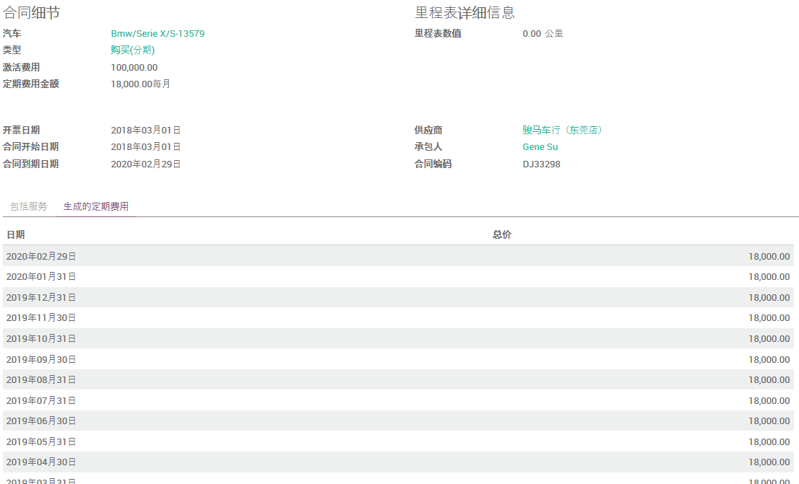

或者，从`汽车`面板上方点击`合同`按钮，也可进入`汽车合同`列表

* 选择合同涉及的`汽车`（若从菜单项进入）
* 选择合同`类型`
* 输入`激活费用`（合同签署时的一次性费用）
* 输入`定期费用金额`及发生频率（`每天`、`每周`、`每月`、`每年`）
* 选择`开票日期`
* 选择`合同开始日期`
* 选择`合同到期日期`
* 输入`里程表数值`（合同生效时）
* 选择`供应商`
* 选择`承包人`（日常事务经手人）
* 输入`合同编码`
* 对于定期费用，将其详细列在下方的`生成的定期费用`列表
* 可在`条款和条件`中输入文字性的合同信息。

## 服务

路径：车队模块 -> 汽车 -> 汽车服务日志

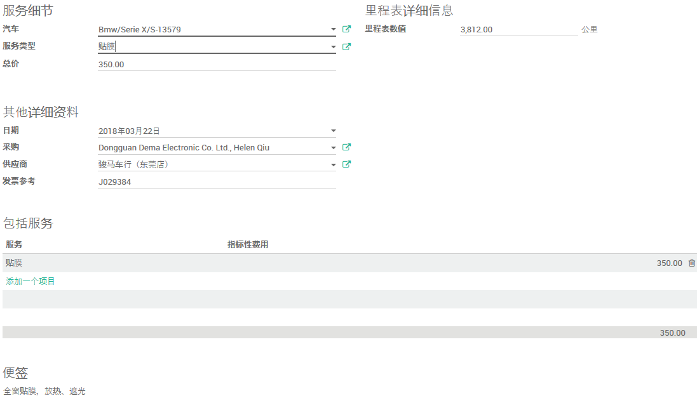

或者，从`汽车`面板上方点击`服务`按钮，也可进入`汽车服务日志`列表

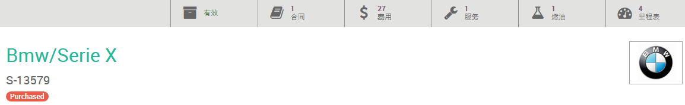

* 选择要记录服务日志的`汽车`（若从菜单项进入）
* 选择`服务类型`
* 输入服务`总价`
* 选择服务`日期`（若非当天登记）
* 选择经手人（`采购`）
* 选择`供应商`
* 录入`发票参考`号码
* 录入`里程表数值`
* 在`包含服务`列表详细列出包含的服务及相关费用
* 可在`便签`栏录入备注信息

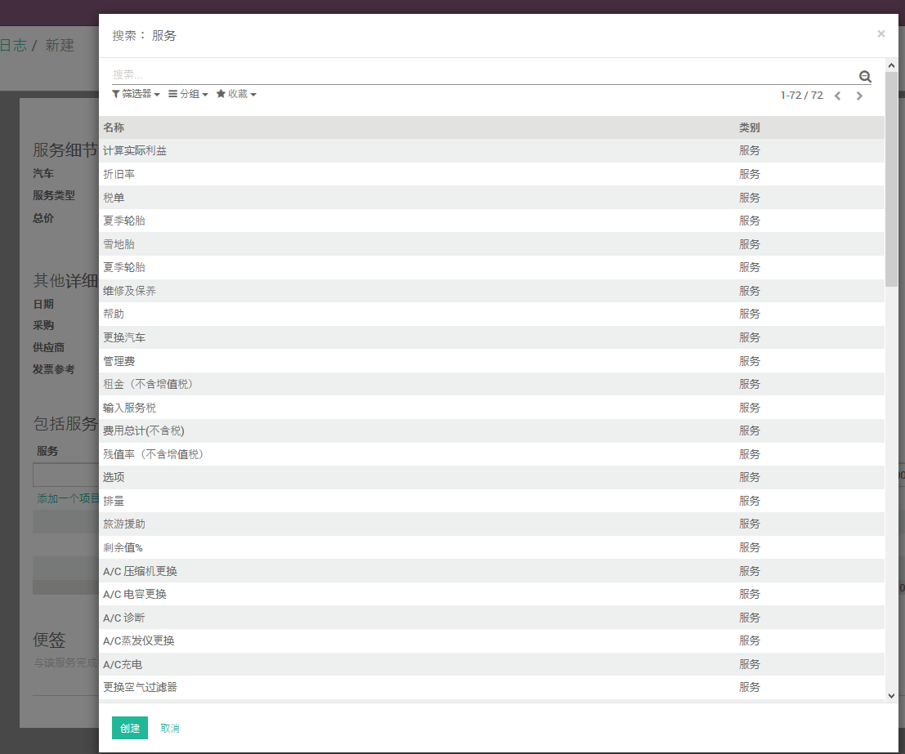

Odoo给出了一些常用的`服务类型`，若有需要，也可另行添加新的`服务类型`。

## 加油

路径：车队模块 -> 汽车 -> 汽车燃油记录

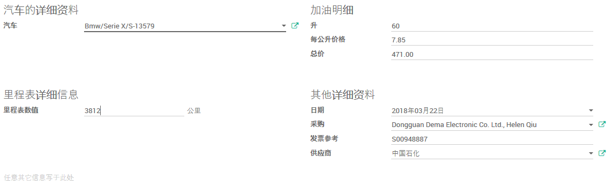

或者，从`汽车`面板上方点击`燃油`按钮，也可进入`汽车燃油记录`列表

* 选择要记录加油的`汽车`（若从菜单项进入）
* 填写`里程表数值`
* 填写加油的`升`数
* 填写燃油`每公升价格`
* `总价`应该会自动按前述两栏的数值自动计算
* 选择加油的`日期`（若非当天登记）
* 选择加油的经手人(`采购`)
* 录入`发票参考`号码
* 选择燃油`供应商`
* 若有详细说明信息，可以在表单下方录入

## 汽车里程表

类似登记车辆（在Odoo中新建汽车）、登记加油、登记服务等事项，其`里程表数值`都会记录到`汽车里程表`中。

若有需要，也可单独、明确记录`汽车里程表`。

路径：车队模块 -> 汽车 -> 汽车里程表

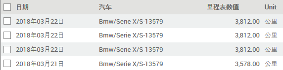

点击`创建`按钮可以添加新的汽车历程记录

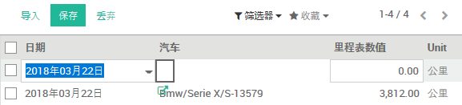

## 汽车成本

路径：车队模块 -> 汽车 -> 汽车成本

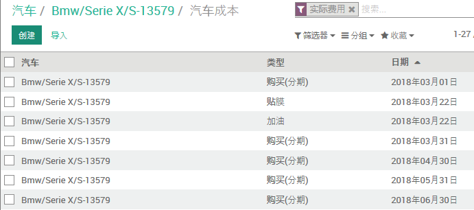

或者，从`汽车`面板上方点击`费用`按钮，也可进入`汽车成本`列表

合同费用、服务费用、燃油费用都会列入`汽车成本`。

若有需要，也可直接添加`汽车成本`记录。

## 费用

路径：车队模块 -> 报告 -> 费用

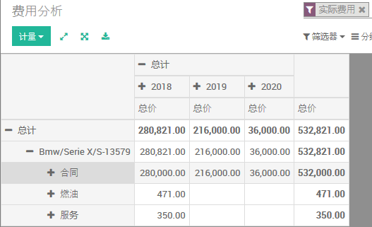