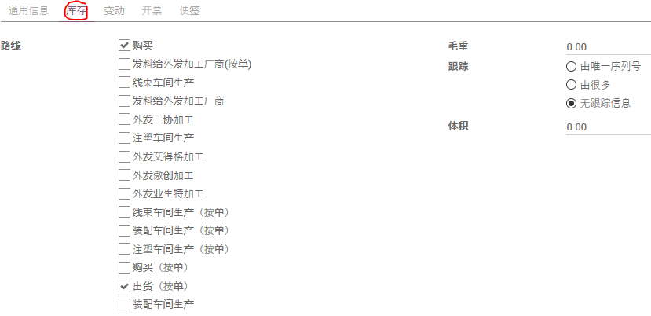
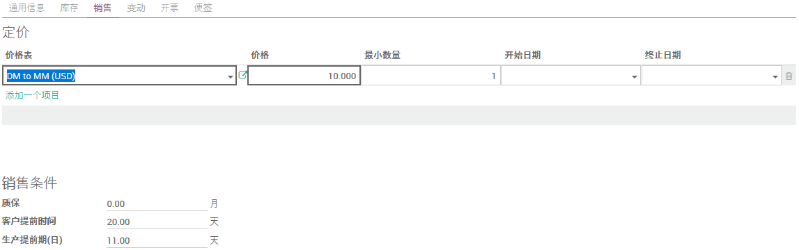

# 产品

## 可库存产品

* 具形实物
* 卖给客户的产品
* 加工、制造的成品、半成品
* 从供应商那里购买的产品
* 固定资产
* 办公家私
* 不属于固定资产，但有相当价值、使用寿命较长的工具
* 生产中跟具体产品密切相关的夹具、治具

## 服务产品

* 以服务形式交付的产品
* 无形产品
* 不可调拨，无实际库存记录，无需盘点

## 可消耗产品

* 具形实物
* 价格、价值较低，不值得投入时间、精力去管理存货的产品
* 可调拨，但无实际库存记录，无需盘点

## 新建产品

* 路径1：销售模块 -> 销售 -> 产品
* 路径2：采购模块 -> 采购 -> 产品
* 路径3：存货模块 -> 库存控制 -> 产品
* 路径4：制造模块 -> 产品 -> 产品
* 路径5：PLM模块 -> 主数据 -> 产品

根据路径不同，进入产品列表（看板）界面时自动应用的筛选器会有差异，可根据需要调整筛选器。

点击`创建`按钮，以新建产品。

### 产品名称

使用长度适中且明具分辨力的`产品名称`，对该产品信息在后续的使用非常有利。

* 第一个单词或短语明确产品的实质
* 根据需要附加适当、适量的限制性短语
* 若有必要，附上关键的、指标性的技术规格
* 总体长度要适中
* 更多、更详细的内容可根据受众分置`报价说明`、`供应商说明`、`拣货描述`

* 根据产品的用途勾选`可销售`、`可被采购`、`可以被费用化`

### 产品通用信息

* 根据上文选择正确的`产品类型`
* 输入产品`编码`（Part Number）
* 选择合理的`内部分类`（参考[产品类别](category.md))
* `标价`用以记录产品的公开价（也叫目录价格）
* `成本`通常不包含税金
* 在多公司环境，`公司`决定了产品`标价`及`成本`等信息的币别
* `计量单位`为该产品在组织内部存储、流通所用
* `采购计量单位`在采购订单中使用
* `控制采购订单`为供应商账单的开具方式：
  * 按`订购数量`开具账单，不管是否已经收货，也不管收货数量多少
  * 按`收到数量`开具账单，则到货开账单，到多少开多少

### 产品库存

* 参考[使用(需求)路线](MRP/using_routes.md)来勾选`路线`
* `毛重`为1`计量单位`该产品的重量，以公斤计数，不含任何包材
* `体积`为1`计量单位`该产品的占地尺寸，以立方米计数
* `跟踪`
  * `由唯一序列号`：每1`计量单位`该产品都有唯一的跟踪号
  * `由很多`：每一跟踪批号对应的批量大小通常大于1
  * `无跟踪信息`：该产品无需跟踪批次

### 供应商报价

* 通过拖动报价行左侧的十字锚可以调整报价的优先顺序
* 可点击报价行右侧的垃圾桶移除该项报价

* 选择`供应商`
* 根据需要输入`供应商产品名称`
* 根据需要输入`供应商产品编码`
* 输入(供应商)`交货提前期`
* 在`最少数量`栏输入起订量
* 输入该起订量对应的`价格`并选择币别
* 若报价指定了`有效`期，请选择起止日期

### 销售报价

* 选择适当的`价格表`
* 输入`价格`
* 输入`最小数量`（起订量）
* 输入报价有效期的`开始日期`和`终止日期`（若有）

* 输入产品的`质保`期(月)
* 输入`客户提前时间`(日)
* 输入`生产提前期(日)`

### 税及开票

* 选择正确的`客户税`
  * 出口产品选择 `Export Tax Free`
  * 国内销售产品选择：
    * 价内含税： `17% VAT Incl.(s)`
    * 价外附税： `17%销项税 DG`
* 选择正确的`供应商税`
  * 价内含税 `17%进项税 DG含税`, 默认选择
  * 价外附税 `进项税17% DG`
* `发票开具策略`
  * `已定数量`, 一旦销售订单确认，即可开出全额发票
  * `已送数量`, 只能根据交付数量开出发票，不能提前，不能多开