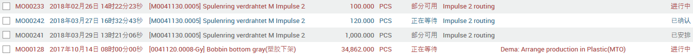
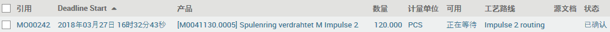
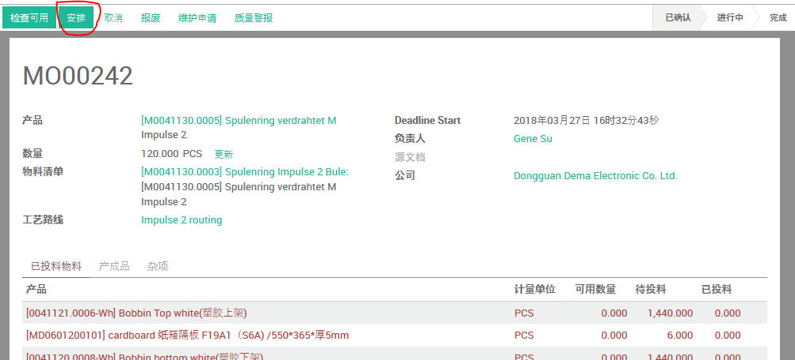
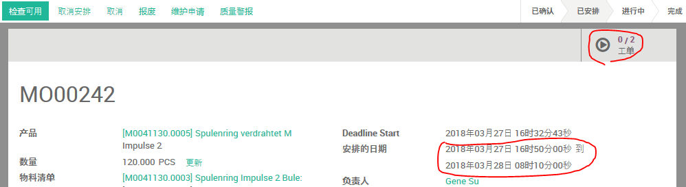
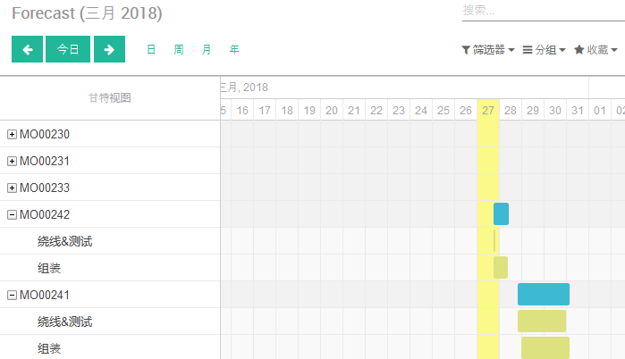
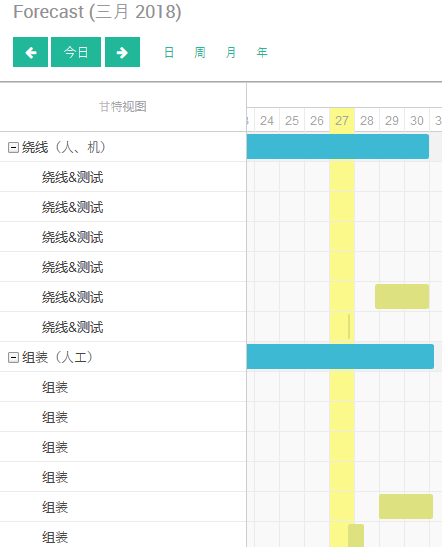
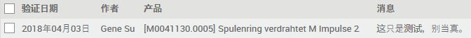
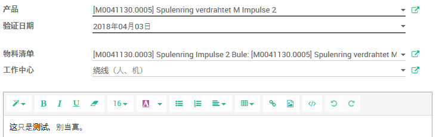
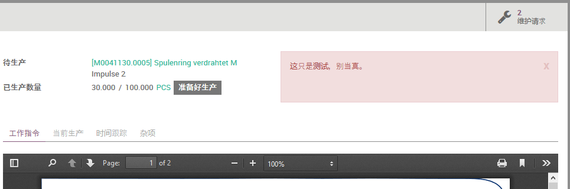

# 计划生产

## 安排生产单

路径：制造模块 -> 规划 -> 待安排的订单

点击`安排`可以为该生产单安排工单。

`工单`将根据相应的`工艺路线`中的`操作`一对一创建。

## 安排工单

路径1： 制造模块 -> 规划 -> 按生产规划

路径2： 制造模块 -> 规划 -> 按工作中心规划

在甘特图上移动对应订单的条块，可以改变其计划日期。

## 工单消息

路径： 制造模块 -> 制造 -> 工单消息

* 选择受影响的`产品`
* 选择受影响的`物料清单`
* 选择`验证日期`
* 选择受影响的`工作中心`
* 输入`工单消息`

相应的工单会显示该`工单消息`。
