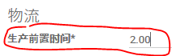
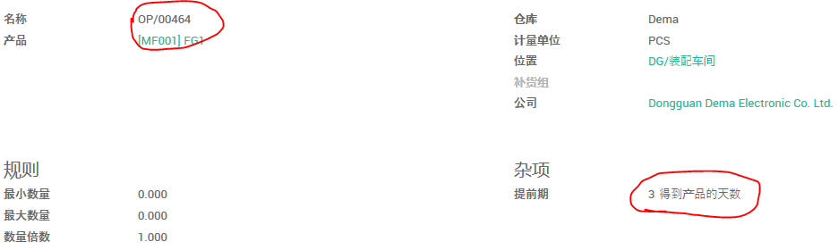

# 制造的前置期

(1). 设置公司范围的制造前置期

路径： 制造模块 -> 配置 -> 设置


(2). 设置产品的制造前置期

在产品设置的销售页可以设置该产品的制造前置期


## 按单出货产品

### 车间备库生产

(1). 公司制造提前期为2天



(2). 公司销售前置期为1天


(3). 客户前置期为20天，生产前置期为11天


(4). 创建并确认销售单


```python
单据日期 + 客户提前期 = 承诺日期
2018-03-08 + 20 = 2018-03-28
确认日期 + 客户提前期 - 公司销售提前期 = 出货计划日期
2018-03-08 + 20 - 1 = 2018-03-27
```

(5). 运行排程

补货前置期为3天。



```python
看上去“得到产品的天数”和“采购产品的天数”对制造单的影响是相同的。
```


```python
2018-03-08 + 3 = 2018-03-11
?? 运行排除的日期 + 补货规则前置期 = 补货的计划日期
```


```python
2018-03-09 - 18 - 1 = 2018-02-18
?? 补货的计划日期 - 产品生产前置期 - 公司生产前置期 = 生产截止期限开始
```

### 车间按单生产

(1). 公司制造提前期为2天


(2). 公司销售前置期为1天


(3). 客户前置期为20天，生产前置期为11天


```python
单据日期 + 客户提前期 = 承诺日期
2018-03-08 + 20 = 2018-03-28
确认日期 + 客户提前期 - 公司销售提前期 = 出货计划日期
2018-03-08 + 20 - 1 = 2018-03-27
```


```python
出货计划日期 - 产品制造前置期 - 公司制造前置期 = 生产截至日期开始
2018-03-27 - 11 - 2 = 2018-03-14
```

### 外发加工

## 备库出货产品
