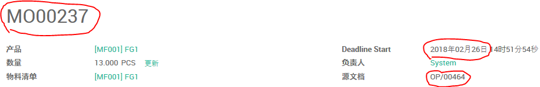

# 制造的前置期

(1). 设置公司范围的制造前置期

路径： 制造模块 -> 配置 -> 设置


(2). 设置产品的制造前置期

在产品设置的销售页可以设置该产品的制造前置期


## 按单出货产品

### 车间备库生产

(1). 公司制造提前期为1天


(2). 公司销售前置期为1天


(3). 客户前置期为20天，生产前置期为18天


(4). 创建并确认销售单


(5). 运行排程


```
2018-03-08 + 1 + 1
```



```
2018-03-09 - 18 - 1 = 2018-02-18
?? 补货的计划日期 - 产品生产前置期 - 公司生产前置期 = 生产截止期限
```

### 车间按单生产

### 外发加工

## 备库出国产品
