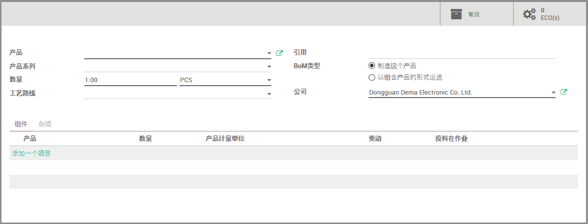
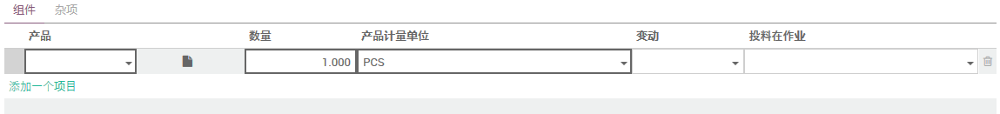
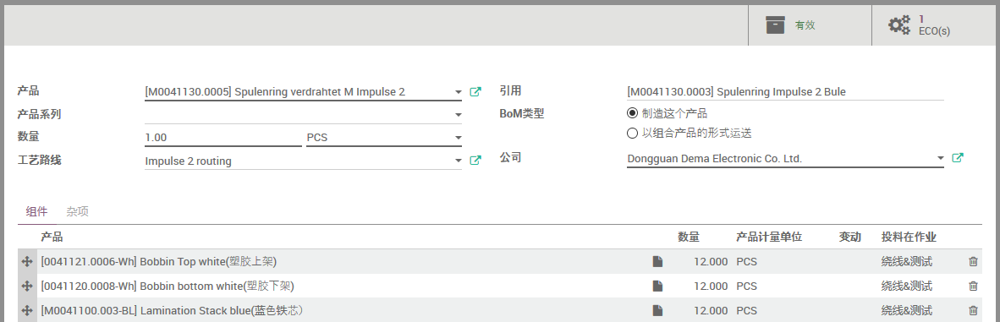

# 设定物料清单 Setup BOM

路径: 制造模块 -> 产品 -> 物料清单

## 新建物料清单

1. 点击‘创建’以新建物料清单
2. 选择‘产品’(母件)
3. 若产品有‘变种’(系列产品)，可在‘产品系列’一栏选择
4. ‘数量’一栏输入物料清单的基数
5. 选择当前物料清单的‘工艺路线’
6. 若产品存在多个物料清单，则‘引用’一栏的信息能给予跟好的帮助
7. ‘BOM’类型：
  * ‘制造这个产品’意味着普通的生产、加工、制造
  * ‘以组合产品的形式运送’用以定义一个套件
    * 比如，确认一张‘套件’产品的销售单，则出库单上出现的是BOM中定义的、相应比例的子件，而非套件自身
    * 再如，B产品是A产品的子件，而B产品自身是套件，则A产品的制造单上待消耗产品会出现B产品的子件，而非B产品自身(所谓Phantom BOM)
8. 点击‘添加一个项目’可以为BOM添加子件

### 添加BOM子件

1. ‘产品’一栏选择子件产品
2. ‘数量’一栏输入子件用量(相对于物料清单的基数，前文有述)
3. ‘产品计量单位’默认会使用子件产品的存储单位，也可根据需要选择同类别的计量单位
4. ‘变动’一栏可以选择子件的适当变种(若有)
5. ‘投料在作业’选择该子件在(BOM的工艺路线的)哪个作业被消耗

## 编辑物料清单

1. 打开物料清单并点击‘编辑’按钮可以进入物料清单编辑页面
2. 拖动子件行首的锚，可以调整子件顺序
3. 点击子件行尾的垃圾桶，可以移除该子件
4. 点击子件行，该子件进入编辑状态
