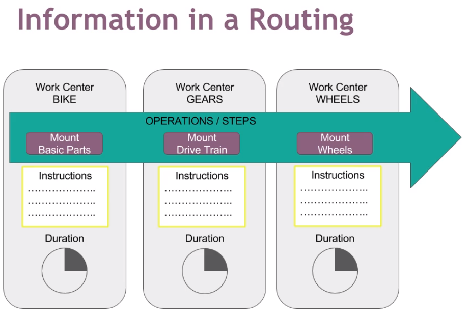

# 设定工艺 Setup Routing

路径: 制造模块 -> 产品 -> 工艺

## 新建工艺

1. 点击"创建"以新建工艺
2. 输入工艺名称及生产库位

### 添加操作 Operation

*在Odoo中，‘Operation’有些时候翻译成‘操作’，有些时候翻译成‘作业’。*

1. 点击“添加一个项目”以打开“创建：作业”画面
2. 输入作业名称
3. 选择执行该作业的‘工作中心’
4. 选择‘下一作业’前置条件
  * ‘所有产品处理完’表示本作业完全完成之前，下一作业不能开始
  * ‘最小数量的产品处理完’表示基本数量的产品完成本作业之后即可流转的下一作业；其它产品可以继续执行本作业
5. ‘时长计算’
  * ‘基于实际时间计算’允许通过对最近完成的一定数量的工单进行统计，自动计算出该作业的时长
  * ‘手动设置时长’可以手动测算并指定该作业时长
6. 在‘说明’一栏备注该作业的注意事项及其它说明。
7. ‘工作表’可以上传作业指导书以指导作业
8. ‘保存并新建’以继续添加下一个作业设定，或者‘保存 & 关闭’以返回‘新建工艺’画面

## 编辑工艺

1. 打开‘工艺’后点击‘编辑’以编辑工艺
2. 如需改变‘作业’的顺序，可以拖动该作业行首的锚
3. 如需删除某项‘作业’，可以点击该作业行尾的垃圾桶
4. 如需编辑某项‘作业’，点击该作业可以进入作业编辑画面
5. 完成编辑后，需要点击‘保存’

