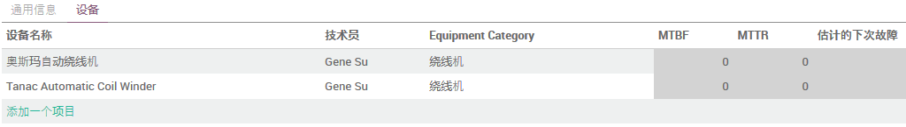
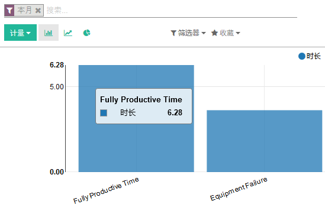
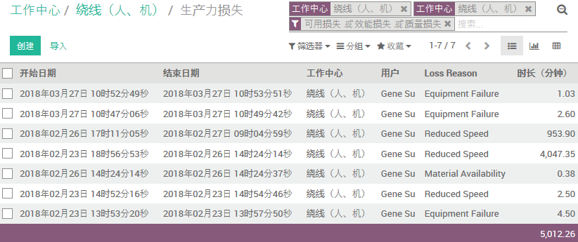
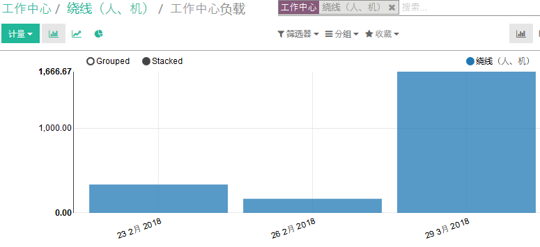
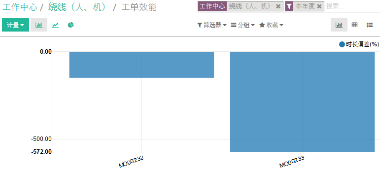

# 设定工作中心 Setup Work Center

路径: 制造模块 -> 产品 -> 工作中心

工作中心是生产活动的场所。工作中心与[工艺路线](setup_routing.md)一起使用，以跨多个步骤和位置划分制造订单的工作。

## 新建工作中心

1. 输入‘工作中心名称’
2. 输入工作中心‘代码’
3. 输入工作中心‘每小时成本’
4. 输入‘生产前准备时间’
5. 输入‘生产后时间’
6. 添加相关[设备](../Maintenance/equipment.md)

* `效率因子`：这个字段描述了资源完成任务的效率。例如，资源单独放在5天的阶段，分配给他的5个任务，默认情况下会显示一个100%的负载，但是如果我们的效率是200%，那么他的负载只会是50%。

* `能力`：可并行生产的工件数。

## 工作中心绩效

从工作中心页面右上角的按钮可以轻松的访问该工作中心各绩效信息的报表

