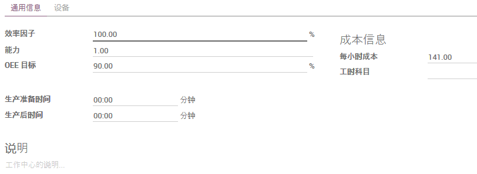

# 设定工作中心 Setup Work Center

路径: 制造模块 -> 产品 -> 工作中心

## 新建工作中心

1. 输入‘工作中心名称’
2. 输入工作中心‘代码’
3. 输入工作中心‘每小时成本’
4. 输入‘生产前准备时间’
5. 输入‘生产后时间’
6. 添加相关设备

工作中心是生产活动的场所。工作中心与[工艺路线](setup_routing.md)一起使用，以跨多个步骤和位置划分制造订单的工作。

