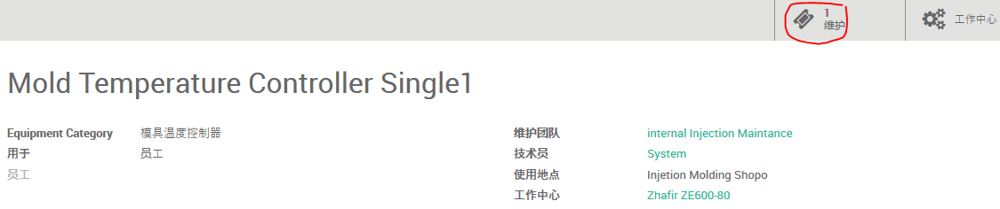
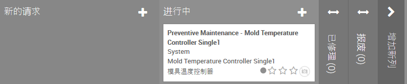
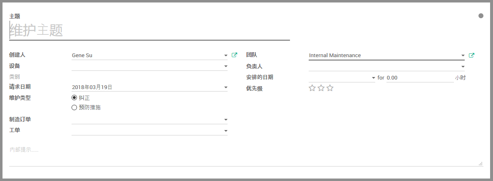
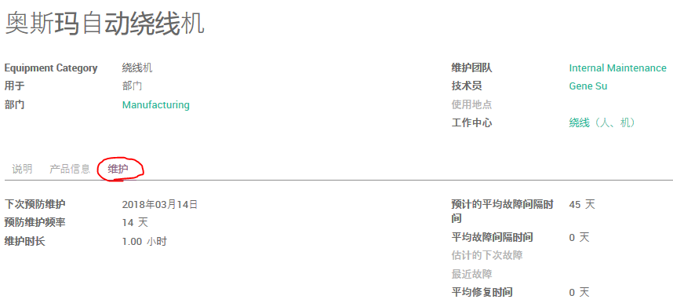
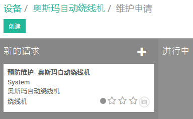

# 维护

通过点击设备页面的 _维护_ 按钮，可用查看该设备的维护记录。

在设备维修记录页面点击 _创建_ 可用创建 _维护申请_ ：

## 维护分为两种类型

* 预防性的保养，目的是保持设备运转，避免故障
* 纠正性的维修，设备出现故障后的修复，以使其再次可用

## 保养

如果[设备](equipment.md)设置了 _预防维护频率_， 则设备看板会显示 _下次预防维护_ 日期，并且自动创建 _维护申请_。
