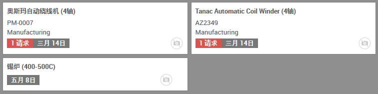

# 维护

在维护模块的仪表板，可以看到跟各`维护团队`有关的维护。

通过点击设备页面的 _维护_ 按钮，可用查看该设备的维护记录。

## 维护日历

路径：维护模块 -> 维护 -> 维护日历

这里可以看到基于日期的简明的维护记录。

## 维护类型

* 预防性的保养，目的是保持设备运转，避免故障
* 纠正性的维修，设备出现故障后的修复，以使其再次可用

## 提出维护申请

路径：维护模块 -> 维护 -> 维护申请

点击 _创建_ 可用创建 _维护申请_ ：

1. `维护主题` 填写维护申请的摘要
2. `设备` 选择该申请的相关设备
3. 选择正确的 `维护类型`
4. 选择相关 `制造订单` (如果该申请发生于制造过程中)
5. 选择相关 `工单` (如果该申请发生于制造过程中)
6. 选择适当的 `负责人`
7. 指定 `安排的日期` 及持续时间(`小时`)
8. 根据需要可以指定 `优先级`
9. 下部的 `内部提示` 可以放入详细说明及注意事项等

## 保养

如果[设备](equipment.md)设置了 _预防维护频率_， 则设备看板会显示 _下次预防维护_ 日期，并且自动创建 _维护申请_。
