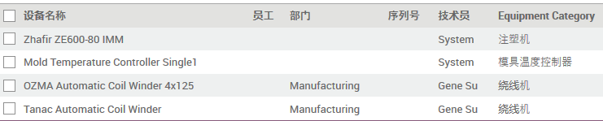
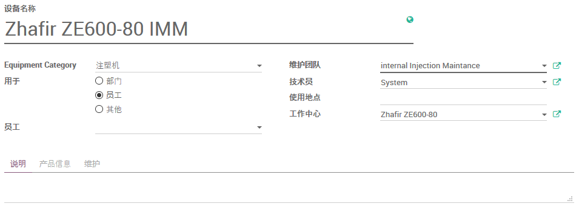
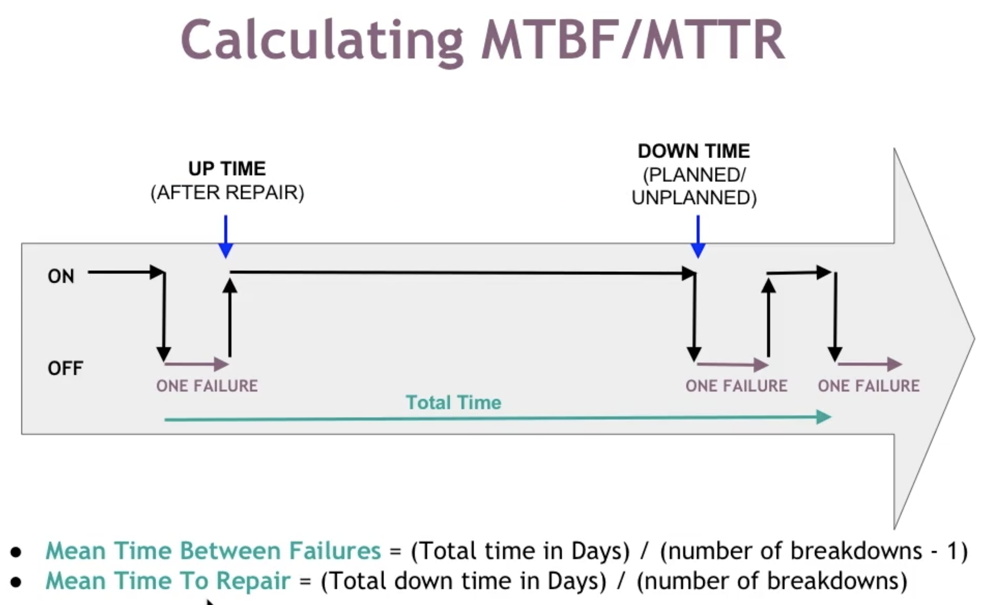
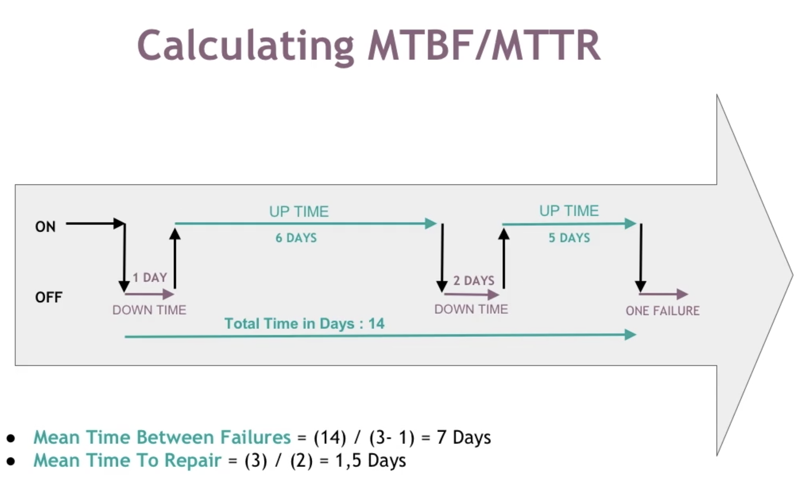

# 设备

## Expected Mean Time Between Failure

**预计的平均故障间隔时间**：两次故障之间的时间预估。

## MTBF (Mean Time Between Failure)

**平均故障间隔时间**：从一个故障到下一个故障的平均时间。通常把它看作是设备正常工作的实际，直到其出现故障并需要维修。

## MTTR (Mean Time To repair)

**平均修复时间**：故障后修复所需的平均时间。

