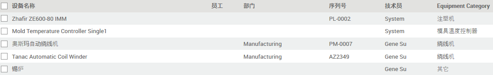

# 设备

* 选择默认的 `维护团队`
* 选择责任人 `技术员`
* 如实填写 `使用地点` 以便资产跟踪。当有变更（移交）时，应及时更新。

* 设备的 `型号` 和 `序列号` 会显示在设备列表中，以帮助快速识别。
* 建议将 `序列号` 用作资产编号，`供应商参考` 用作机器出厂号或序列号。
* `质保` 一栏填写质保到期日，最好如实填写，不留空。

* 设置 `预防维护频率`，系统会自动产生 `维护申请`。

## Expected Mean Time Between Failure

**预计的平均故障间隔时间**：两次故障之间的时间预估。

## MTBF (Mean Time Between Failure)

**平均故障间隔时间**：从一个故障到下一个故障的平均时间。通常把它看作是设备正常工作的实际，直到其出现故障并需要维修。

## MTTR (Mean Time To repair)

**平均修复时间**：故障后修复所需的平均时间。

## 设备类别

适当对设备进行分类，有助于设备管理的有序进行。

