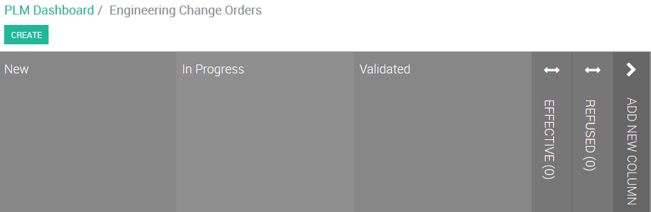

# Engineering Change 工程变更

*When you need modify BOM or Routing, please follow this procedure.*

*当需要更改物料清单及工艺路线时，请使用本工程变更流程。*

Path: PLM module
路径：PLM 模块

## Request Change 发起变更

(1). Click “ENGINEERING CHANGES” of the Kanban
点击看板上的“工程变更”

> from Moritz:
>> New Product Introduction: 适用于未进入量产阶段的产品的工程变更
>> Winding In production change orders: 适用于已量产的绕线产品的工程变更
>> Plastic in Production change orders: 适用于已量产的注塑产品的工程变更

(2). Click “CREATE”
点击“创建”

(3). Give a meaningful name, and select the product this ECO for
输入一个有适当意义的名称，并选择工程变更的相应产品

Input engineering change content and reason at NOTE field.
在NOTE一栏填写变更的详细内容/原因

click "SAVE"。
点击“保存”。

## Plan Change 规划变更

(4). Open ECO and click 'IN PROGRESS' at state list
打开ECO并点击状态列表中的‘IN PROGRESS’

OR, Drag ECO board from “New” to “In Process” to start the flowing.
或者，将工程变更单从“新建”拖动到“在处理”以开始流程

(5). Click “START NEW REVISION”
点击“开启新版本”

(6). Click “Bill of Material Rev :x”
点击“物料清单 版本 :x”

(7). Update the BOM
更新物料清单

click 'Save'.
点击‘保存’。

(8). Click current ECO to return
点击当前的ECO以返回

(9). Click “BOM CHANGES” to review what has changed
点击“BOM变更”以查看到底改了什么内容

(10). Drag ECO board from “In Process” to “Validated” for review
将工程变更单从“在处理“拖动到”验证“以进入评审环节

## Review ECO 评审工程变更

(11). Open the ECO, BOM CHANGES and ROUTING CHANGES can be found at bottom, also the CHANGE NOTE.
打开ECO，BOM变更和工艺变更都可以在下方找到，另外还有变更的说明。

Give your judgement by click 'APPROVE' or 'REJECT' button.
通过‘批准’或‘拒绝’按钮给出判定。

Then move ECO to the next stage.
然后将ECO移动到下一阶段。

## Apply ECO

(12). Open ECO and click “APPLY CHANGES”
打开工程变更单并点击“应用变更”
