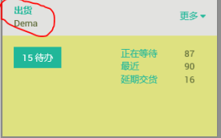
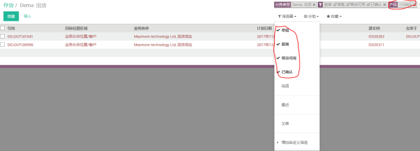
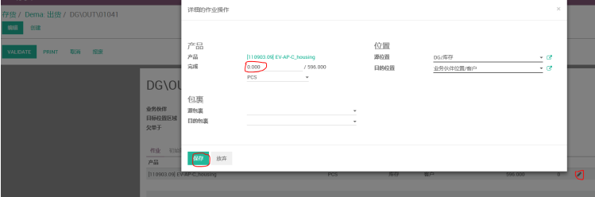
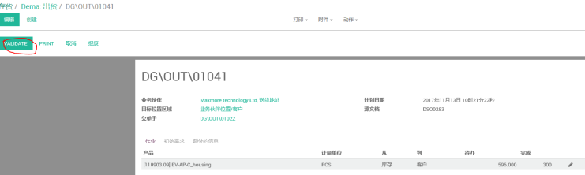

# 出库单

编制 | 日期
----- | -----
Lancy | 2018年1月

(1) 打开存货--出货界⾯

(2) 勾选筛选器中的草稿、就绪、等待可⽤、已确认等信息，以防漏单，输⼊产品编号或SO号进⾏查找

(3) 打开需出货单据，点击作业完成边上的笔状图标，将出货数量录⼊到完成那⾥，然后点击保存

(4) 点击VALIDEATE进⾏验证

(5) ⼀般订单出货数量全部完成，则⽆提⽰，如只收完⼀部分，则会有以下提⽰供你选择，如果未交的订单还需继续出货，则点击“创建未完成订单”，系统会创建另外⼀张接收单。如未交完的订单⽆需再出货，则点击“没有未完成的订单”，系统会⾃动取消已创建的另外⼀张接收单。

