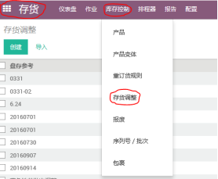
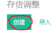
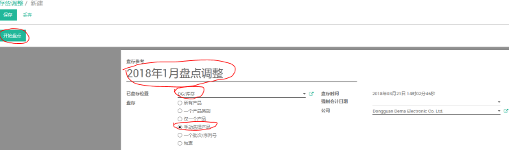
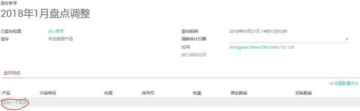
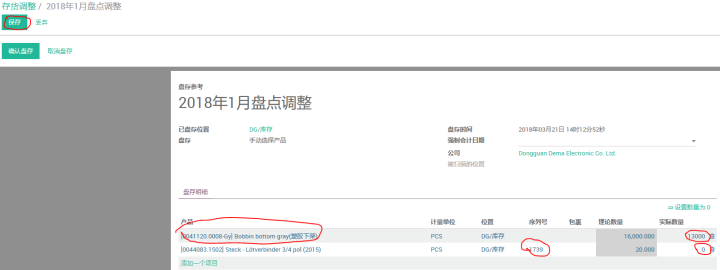
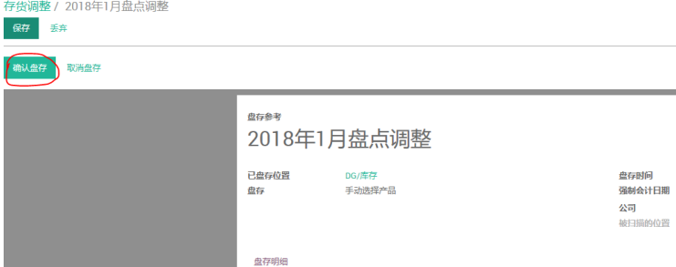

# 存货调整

编制 | 日期
----- | -----
Lancy | 2018年3月

(1) 打开存货--库存控制--存货调整界⾯

(2) 点击创建

(3) 输⼊整调名称、已盘存位置、盘存选项，最后点击开始盘点

(4) 点击添加⼀个项⽬

(5) 输⼊产品编号找到需要调整的产品，有批次号的需要在序列号那⼀栏录⼊相应批次号，再跟据盘点数量录⼊实际数量，然后点击保存

(6) 点击确认盘存

