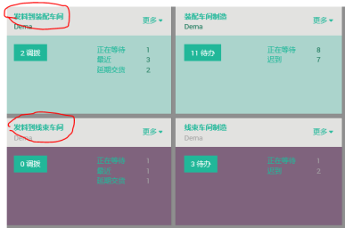
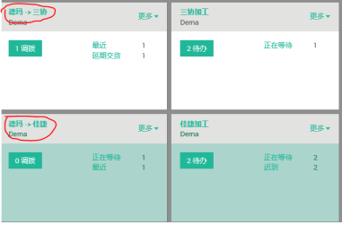
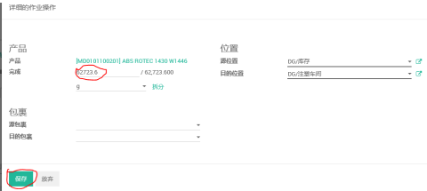
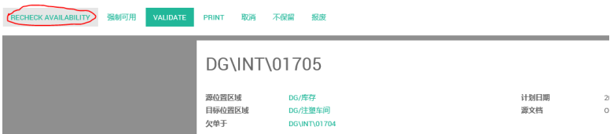
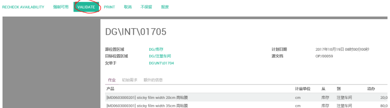
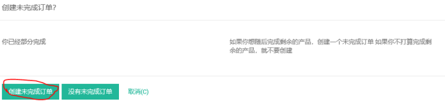

# 领料单

编制 | 日期
----- | -----
Lancy | 2018年1月

适⽤范围：各个⽣产车间⽣产物料领⽤，外发材料给供应商加⼯

(1) 打开“存货” 发料到XX车间（选择打开对应的车间）或者德玛-XX(供应商）

(2) 在作业界⾯找到需要发出的材料，并将发出数量填上，然后点击保存

(3) 如果作业界⾯找不到所需要发出的材料，需点击RECHECK AVAILABILITY,如果还没有出现，请意留是否有库存

(4) 点击VALIDEATE

(5) 如果有未完成未发的材料，则点击创建未完成订单，⽆未发的材料，则点击没有未完成订单

