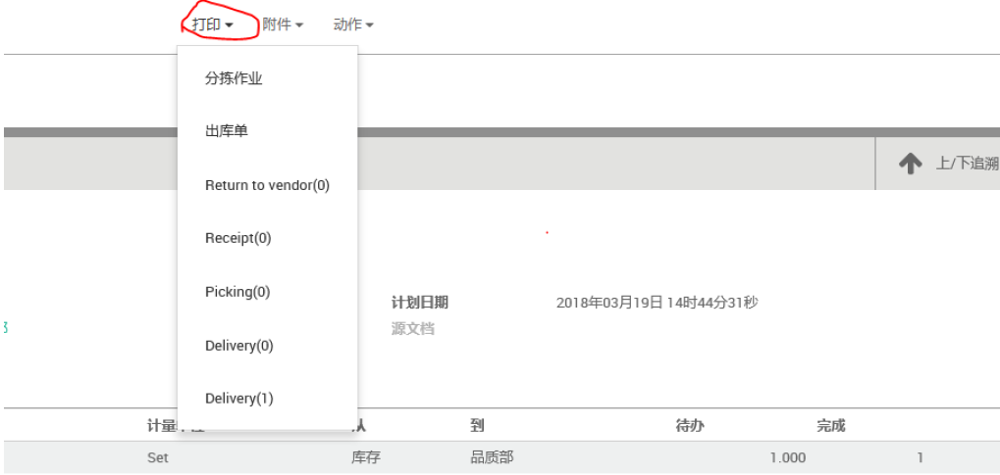

# 打印单据

编制 | 日期
----- | -----
Lancy | 2018年3月

ODOO中可以打印的单据有接收单、领料单、退货单、出库单，操作如下：

(I) 找到需要打印的单据，点击印打边上的下拉符号，就会出现如图所⽰信息

(II) 选择与之对应的打印单据，单据后⾯带

* (0)的表⽰为需套打单据
* (1)表⽰为直打单据

可打印单据

* Return to vendor -- 退货单
* Receipt -- ⼊库单
* Picking -- 领料单
* Delivery -- 出库单