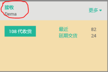

# 接收单

编制 | 日期
----- | -----
Lancy | 2018年1月

适⽤范围：所以⾛采购订单的物料进⾏⼊库作业

(1) 打开“存货” -> “接收”界⾯

(2) 根据供应商的送货单找到相应PO号，或者材料编号\名称，或者供应商信息，并点击打开

(3) 核对相关信息，源⽂档为采购PO，作业以下是相对应的产品信息及数量。点击笔状图标，并在完成处录⼊相应的送货数量，点击保存。

(4) 有些产品需录⼊批次号，则点击完成边上的⼩图标，然后录⼊相应的批次及数量

(5) 点击“VALIDATE”进⾏验证

(6) ⼀般订单收货数量全部完成，则⽆提⽰，如只收完⼀部分，则会有以下提⽰供你选择，如果未交的订单还需继续交货，则点击“创建未完成订单”，系统会创建另外⼀张接收单。如未交完的订单⽆需再交货，则点击“没有未完成的订单”，系统会⾃动取消已创建的另外⼀张接收单。

