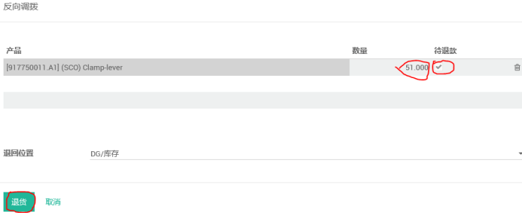

# 退货单

编制 | 日期
----- | -----
Lancy | 2018年3月

(1) 打开存货接收单，找到需要退的那批产品相对应的⼊库单。

(2) 点击内容项打开，点击退货

(3) 选择需要退的产品，不需退的删除掉，输⼊数量，勾选待退款

(4) 系统会⾃动⽣产退货单，点击笔状图标，录⼊完成数量后，点击VALIDATE进⾏验证

(5) 点击VALIDATEF进⾏验证

(6) 退货单可以在存货 - 退回供应商界⾯输⼊退货单号或供应商查询

(7) 退货单录⼊完成

(8) 如果供应商再补退货的退货单做需做反向退货，在退货单上点击“退货”

(9) 输⼊供应商需补退货的数量，勾选待退款后点击退货

(10) 等下次供应商补退货过来后直接去存货--接收单界⾯可按退货单号查询，具体操作可参考接收单
操作。