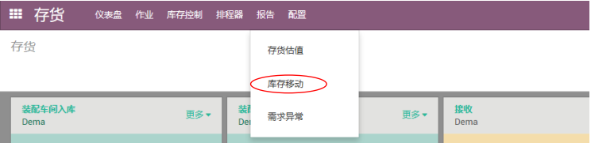
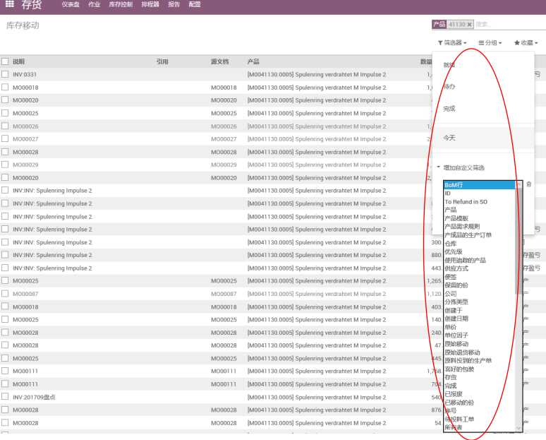
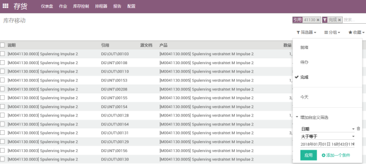
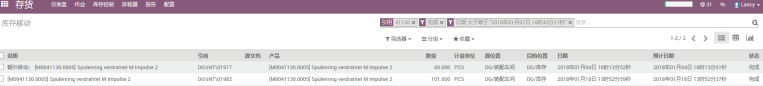
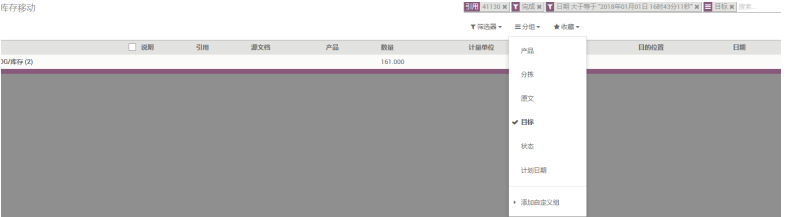

# 产品追溯

编制 | 日期
----- | -----
Lancy | 2018年1月

(1). 进⼊存货界⾯，点击报告 -> 库存移动

(2). 可以搜已知的信息，⽐如“产品息信”、“单号”、“位置”、“业务伙伴”

(3). 也可以⽤筛选器进⾏筛选你所希望看到的信息，

(4). 筛选设置完成后，点击“应⽤”

(5). 筛选内容及结果如下

(6). 可将筛选的结果进⾏分组，⽅便查看所需数据

> 库存移动⾥可以查看到所有在ODOO中所产⽣单据，信息量巨⼤，如果想找出其中的⼀项或者⼏项，给出的条件越多越细致，找到结果越接近你的需要。