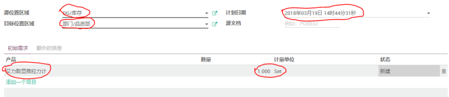
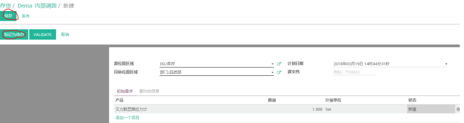
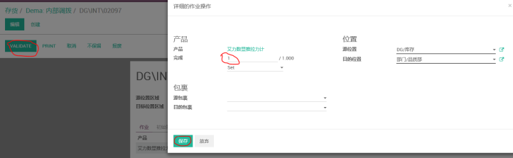

# 调拨单

编制 | 日期
----- | -----
Lancy | 2018年3月

_适⽤范围：各个部门领⽤⾮⽣产性物料或者样品开具调拨单_

(1) 打开“存货” -> “内部调拨”界⾯，点击“创建”

(2) 选择源置位区域、⽬标置位区域、计划⽇期,输⼊产品信息及数量

(3) 点击“保存”后再点击“标记为待办”

(4) 点击“延期”

(5) 在作业那个界⾯，输⼊对应的数量，点击笔状图标，在完成处录⼊相应的送货数量，点击保存。之后点击“VALIDATE”进⾏验证

