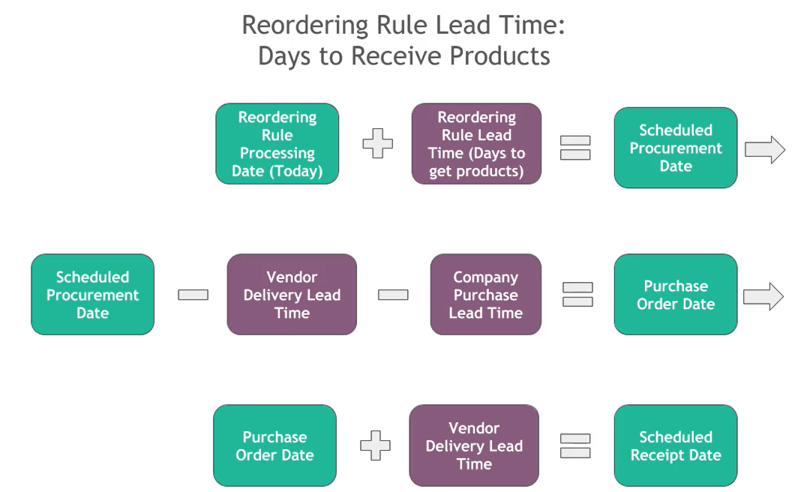
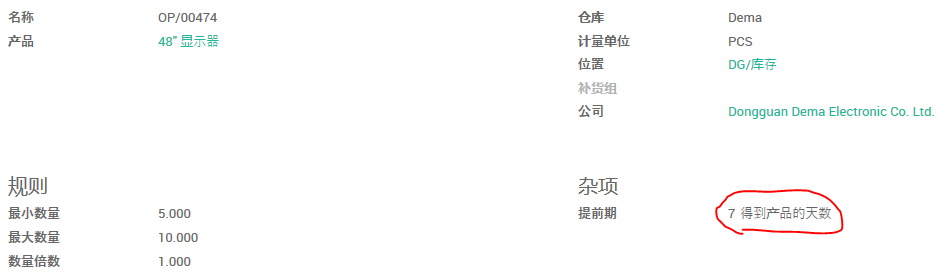
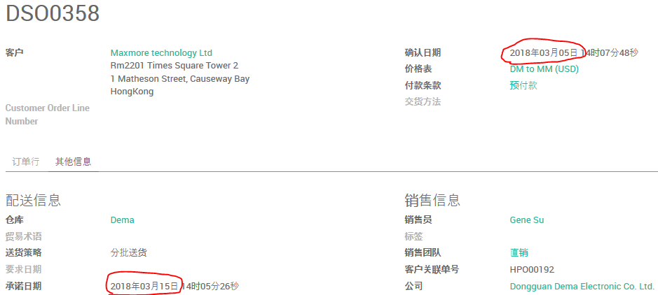
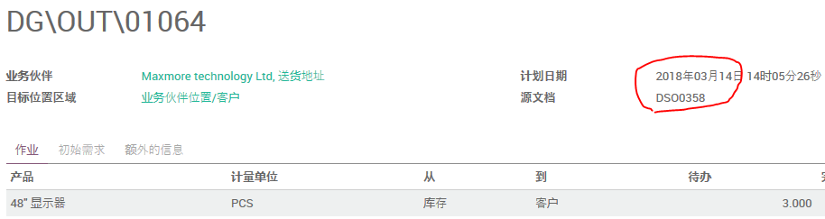
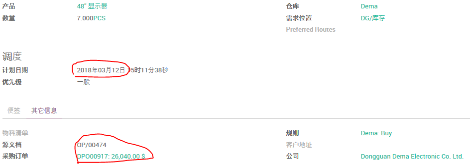
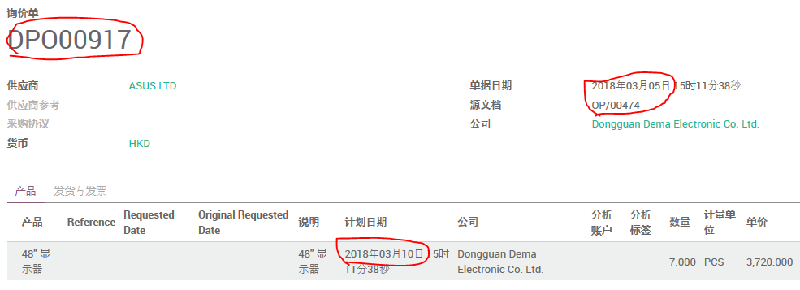
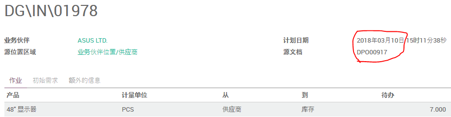

# 重订货规则的前置期：获取产品的天数



(1). 设定产品的 **客户提前时间** 为10天。

(2). 设置公司的 **销售安全天数** 为1天。

(3). 设定供应商的 **交货提前时间** 为5天。

(4). 设置公司的 **采购前置期** 为2天。

(5). 设置产品的 **重订货规则** 的 **提前期** 为7天得到产品。



(6). 创建并确认销售订单



```
承诺日期 = 销售确认日期 + 客户提前时间
2018-03-15 = 2018-03-05 + 10
```


```
销售交货计划日期 = 销售确认日期 + 客户提前时间 - 销售安全天数
2018-03-14 = 2018-03-05 + 10 - 1
```

(7). 运行排程器

路径：存货模块 -> 排程器 -> 计划排程器

从产品的 **补货** 页可以找到相应的补货单。



```
重订货规则运行日期 + 重订货规则提前期 = 补货单计划日期
2018-03-05 + 7 = 2018-03-12
```

(8). 确认采购单

点击 **补货单** 左下角的采购订单号可以直接打开该采购订单。



可以看到采购单的订单日期为 **2018-03-05**

```
采购订单日期 = 补货单计划日期 - 供应商交货提前时间 - 公司的采购前置期
2018-03-05 = 2018-03-12 - 5 - 2
```
确认采购单，在右上角打开 **发货单**。



可以看到采购入库单的计划日期是 **2018-03-10**

```
采购订单日期 + 供应商交货提前时间 = 入库单计划日期
2018-03-05 + 5 = 2018-03-10
```
