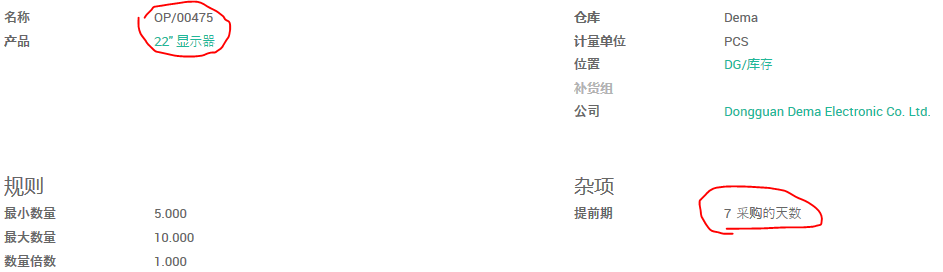
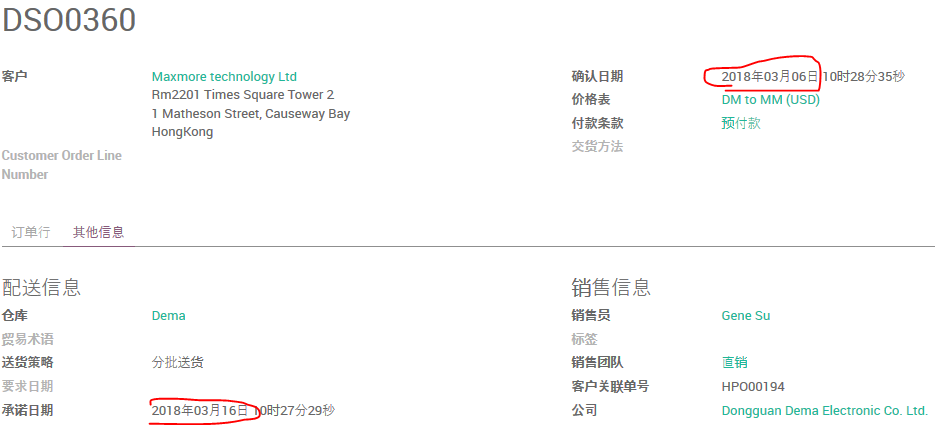
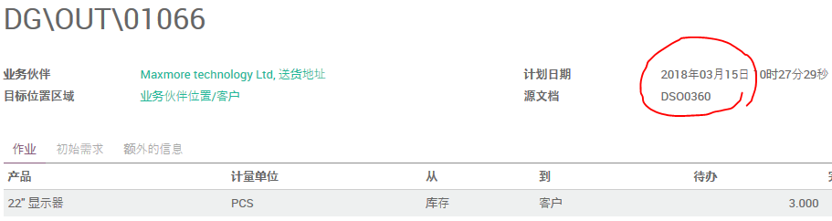
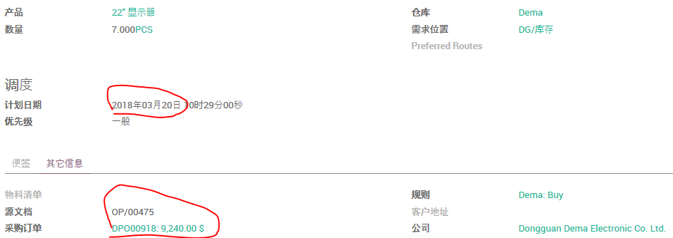
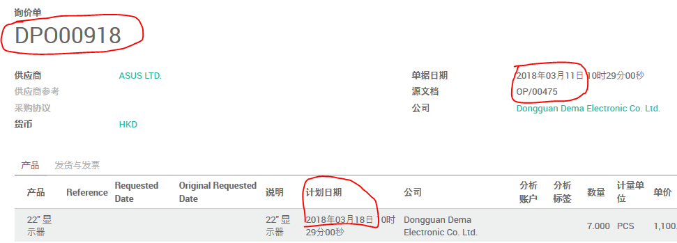
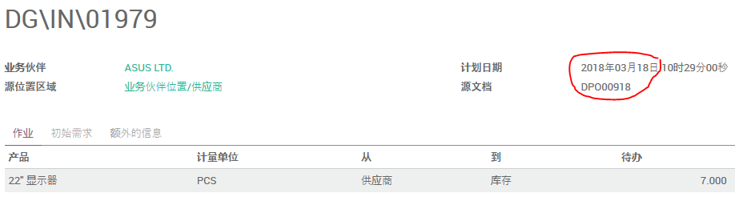

# 重订货规则的前置期：购买产品之前的天数

*这项设定的天数为采购流程开始之前的天数。*


```
重订货规则运行日期 + 重订货规则前置期 + 供应商前置期 = 补货单计划日期
补货单计划日期 - 供应商前置期 - 公司采购提前期 = 采购订单日期
采购订单日期 + 供应商前置期 = 入库单计划日期
```

(1). 设定产品的 **客户提前时间** 为10天。

(2). 设置公司的 **销售安全天数** 为1天。

(3). 设定供应商的 **交货提前时间** 为5天。

(4). 设置公司的 **采购前置期** 为2天。

(5). 设置产品的 **重订货规则** 的 **提前期** 为7天得到产品。



(6). 创建并确认销售订单



```
销售确认日期 + 客户提前时间 = 承诺日期
2018-03-06 + 10 = 2018-03-16
```



```
销售确认日期 + 客户提前时间 - 销售安全天数 = 销售交货计划日期
2018-03-06 + 10 - 1 = 2018-03-15
```

(7). 运行排程器

路径：存货模块 -> 排程器 -> 计划排程器

从产品的 补货 页可以找到相应的补货单。



```
重订货规则运行日期 + 重订货规则前置期 + 供应商前置期 = 补货单计划日期
2018-03-06 + 7 + 7 = 2018-03-20
```
(8). 确认采购单
点击 补货单 左下角的采购订单号可以直接打开该采购订单。



可以看到采购单的订单日期为 **2018-03-11**

```
补货单计划日期 - 供应商前置期 - 公司采购提前期 = 采购订单日期
2018-03-20 - 7 - 2 = 2018-03-11
```

确认采购单，在右上角打开 **发货单**。



可以看到采购入库单的计划日期是 **2018-03-18**

```
采购订单日期 + 供应商前置期 = 入库单计划日期
2018-03-11 + 7 = 2018-03-18
```
