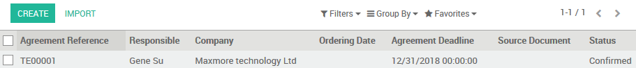
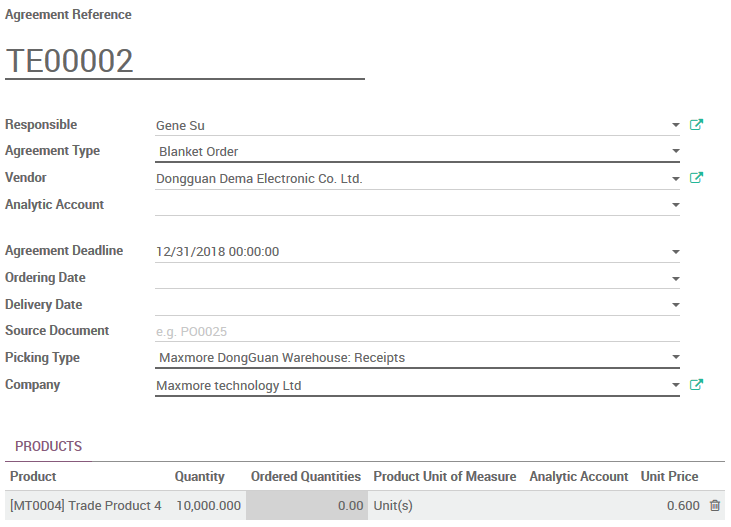
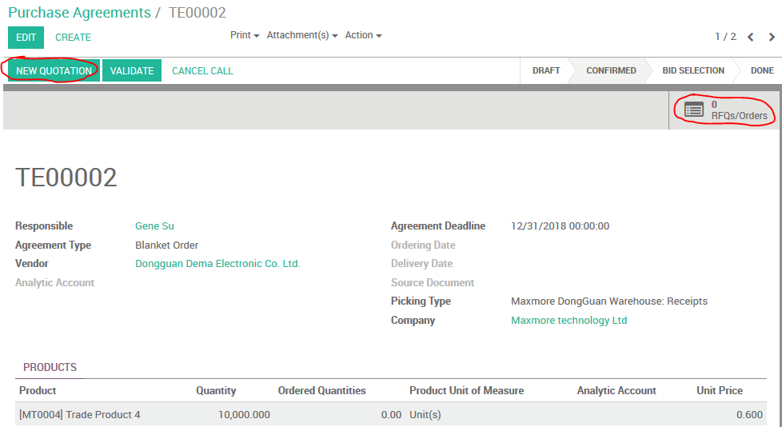
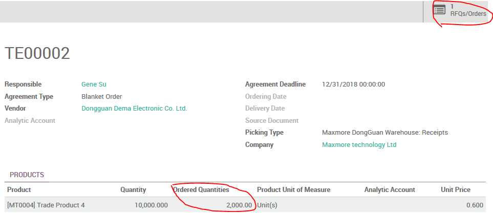

# Purchase Agreement

Click `CREATE` to create a new Purchase Agreement.

## Blanket Order

* choose `Blanket Order` at `Agreement Type`
* key in `Agreement Deadline`
* choose correct `Picking Type`
* select `Product` and key in `Quantity` and `Unit Price`
* `CONFIRM` the Agreement

## New Quotation

When you decide to get delivery, you should create formal PO via new Quotation.

First open the Blanket Order, then click `New Quotation`, or click `RFQs/Orders` buttom then click `Create` buttom.

Just like other quotation, the differences are:

* Vendor
* Vendor Reference
* Products

the above items have been prepared from Blanket Order. You just need key in `Quantity` and confirm the quotation.

When you back to Blanket Order, you can find `Order Quantities` has added, and `RFQs/Orders` quantity also added.

## Work Flow

* in Maxmore, create the Blanket Order, and release it to Dema
* in Dema, create the Blanket Order according to Maxmore Blanket Order, and release it to Supplier
* when Customer order come into Maxmore, make sure the products set to MTS
  * create & confirm PO in Blanket Order
  * create & confirm SO
* Dema will get Sale Quotations when Maxmore confirm PO in Blanket Order, just confirm it
* Dema release PO to Supplier