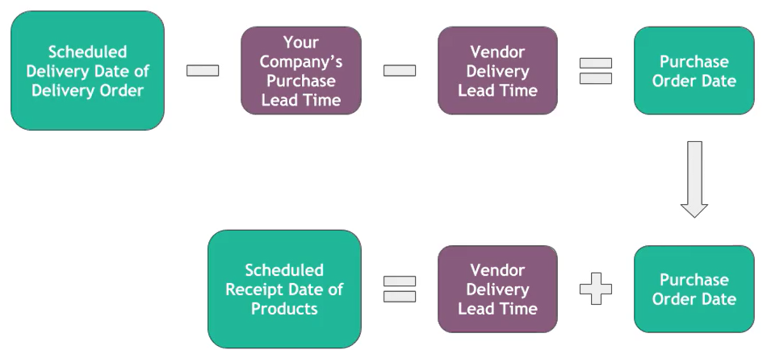
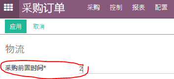
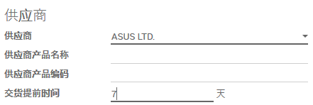
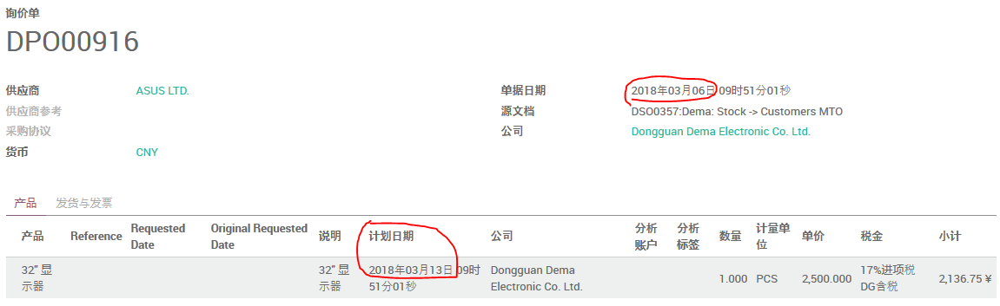
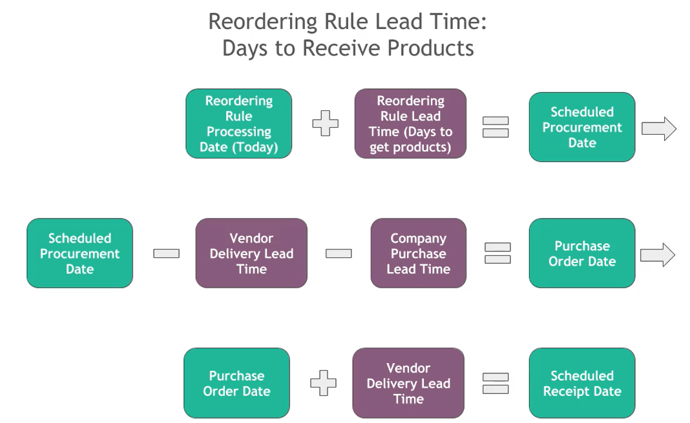
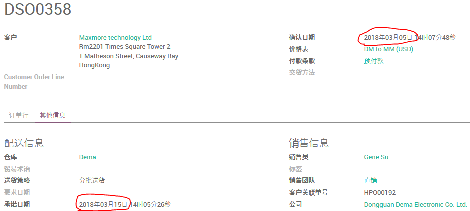
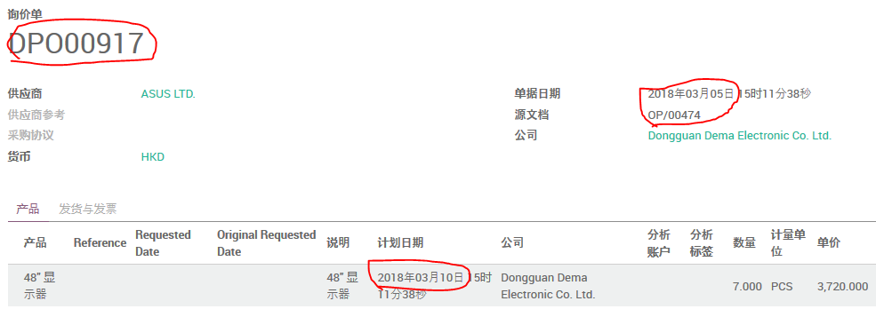

# Purchase Lead Time

## 手工创建的采购单


(1). 设置供应商交货提前期

在产品设置的 **库存** 页，打开供应商报价


录入供应商的 **交货提前期**


(2). 创建采购订单


选择前面设置 **交货提前期** 的供应商及产品，保存订单。
可以看到 **计划日期** 在 **单据日期** 的基础上附加了 **交货提前期** 的天数。

    2018-03-05 + 3 = 2018-03-08

打开订单行，同样可以看到 **计划日期**，这是我们预计货物从卖方到达的日期。


(3). 确认采购订单

点击 **确认订单**，然后可以从右上角的 **发货单** 打开该采购单对应的 **入库单**。


可以看到入库单的计划日期为 `2018-03-08`


## MTO产品的采购订单



```
销售交货日期 - 公司的采购提前期 - 供应商交货提前期 = 采购订单日期

采购订单日期 + 供应商交货提前期 = 入库单的计划日期
```

(1). 设置 **公司的采购提前期**

路径：采购模块 -> 配置



这里的设定对该公司的所有采购单有效（跟特定供应商无关）。

(2). 设置供应商交货提前期

将产品设置为 **按单出货**


设置产品的 **供应商交货提前期**



(3). 创建并确认销售单

创建并确认销售单，打开出库单，看到 **销售交货日期**。


(4). 确认采购订单

在采购询价单列表找到刚才确认销售订单所产生的采购询价单，打开它。



可以看到采购订单日期为 **2018-03-06**

    2018-03-15 - 2 - 7 = 2018-03-06

同样可以在订单行看到 **计划日期** 为 **2018-03-13**

    2018-03-06 + 7 = 2018-03-13

## 重订货规则的提前期

有两种方式来设定重订货规则的提前期：
1. 设定 **获取产品的天数**
2. 设定 ****

### 获取产品的天数



(1). 设定产品的 **客户提前时间** 为10天。

(2). 设置公司的 **销售安全天数** 为1天。

(3). 设定供应商的 **交货提前时间** 为5天。

(4). 设置公司的 **采购前置期** 为2天。

(5). 设置产品的 **重订货规则** 的 **提前期** 为7天得到产品。


(6). 创建并确认销售订单



```
承诺日期 = 销售确认日期 + 客户提前时间
2018-03-15 = 2018-03-05 + 10
```


```
销售交货计划日期 = 销售确认日期 + 客户提前时间 - 销售安全天数
2018-03-14 = 2018-03-05 + 10 - 1
```

(7). 运行排程器

路径：存货模块 -> 排程器 -> 计划排程器

从产品的 **补货** 页可以找到相应的补货单。


```
重订货规则运行日期 + 重订货规则提前期 = 补货单计划日期
2018-03-05 + 7 = 2018-03-12
```

(8). 确认采购单

点击 **补货单** 左下角的采购订单号可以直接打开该采购订单。



可以看到采购单的订单日期为 **2018-03-05**

```
采购订单日期 = 补货单计划日期 - 供应商交货提前时间 - 公司的采购前置期
2018-03-05 = 2018-03-12 - 5 - 2
```
确认采购单，在右上角打开 **发货单**。


可以看到采购入库单的计划日期是 **2018-03-10**

```
采购订单日期 + 供应商交货提前时间 = 入库单计划日期
2018-03-05 + 5 = 2018-03-10
```

### 采购产品的天数
