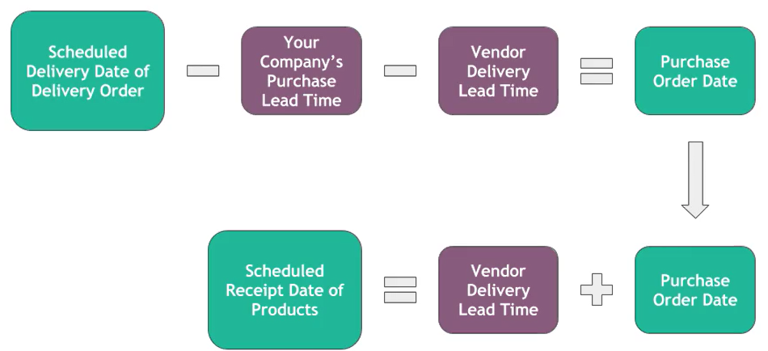
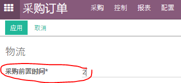
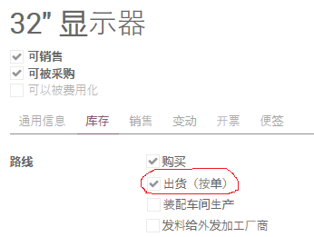
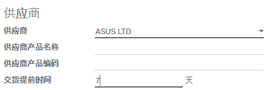
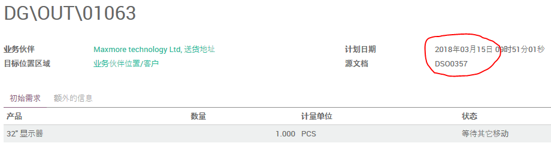
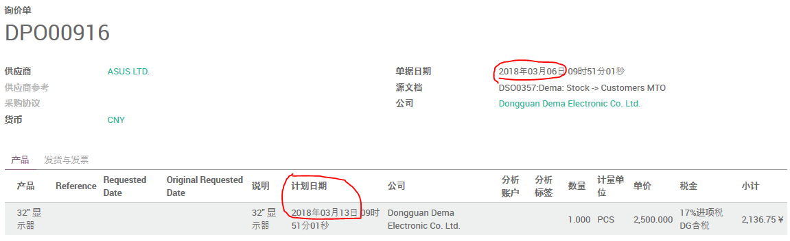

# MTO产品的采购订单的 Lead Time



```
销售交货日期 - 公司的采购提前期 - 供应商交货提前期 = 采购订单日期

采购订单日期 + 供应商交货提前期 = 入库单的计划日期
```

(1). 设置 **公司的采购提前期**

路径：采购模块 -> 配置



这里的设定对该公司的所有采购单有效（跟特定供应商无关）。

(2). 设置供应商交货提前期

将产品设置为 **按单出货**



设置产品的 **供应商交货提前期**



(3). 创建并确认销售单

创建并确认销售单，打开出库单，看到 **销售交货日期**。



(4). 确认采购订单

在采购询价单列表找到刚才确认销售订单所产生的采购询价单，打开它。



可以看到采购订单日期为 **2018-03-06**

    2018-03-15 - 2 - 7 = 2018-03-06

同样可以在订单行看到 **计划日期** 为 **2018-03-13**

    2018-03-06 + 7 = 2018-03-13
