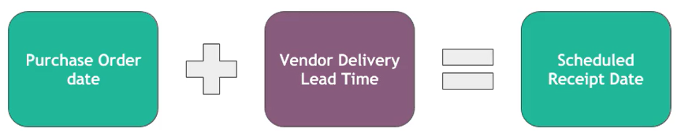
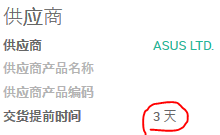
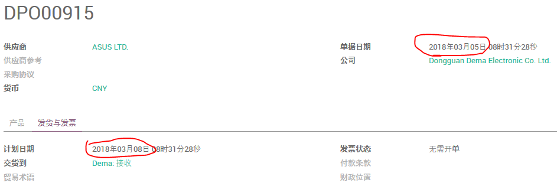
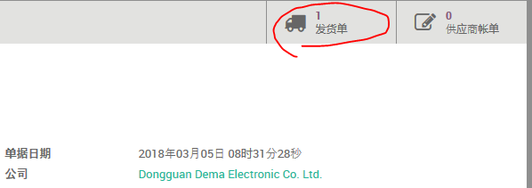

# 手工创建的采购订单的前置期

(1). 设置供应商交货提前期

在产品设置的 **库存** 页，打开供应商报价

录入供应商的 **交货提前期**

(2). 创建采购订单

选择前面设置 **交货提前期** 的供应商及产品，保存订单。
可以看到 **计划日期** 在 **单据日期** 的基础上附加了 **交货提前期** 的天数。

    2018-03-05 + 3 = 2018-03-08

打开订单行，同样可以看到 **计划日期**，这是我们预计货物从卖方到达的日期。

(3). 确认采购订单

点击 **确认订单**，然后可以从右上角的 **发货单** 打开该采购单对应的 **入库单**。

可以看到入库单的计划日期为 `2018-03-08`

