# 质量

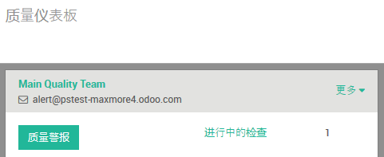

## 质量警报团队

路径：质量模块 -> 配置 -> 质量警报团队

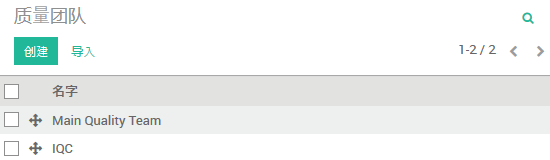

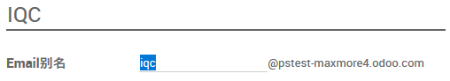

* 输入`团队名称`
* 输入团队`Email别名`

## 质量警报阶段

路径：质量模块 -> 配置 -> 质量警报阶段

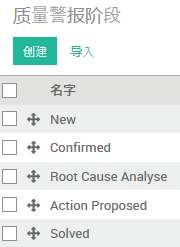

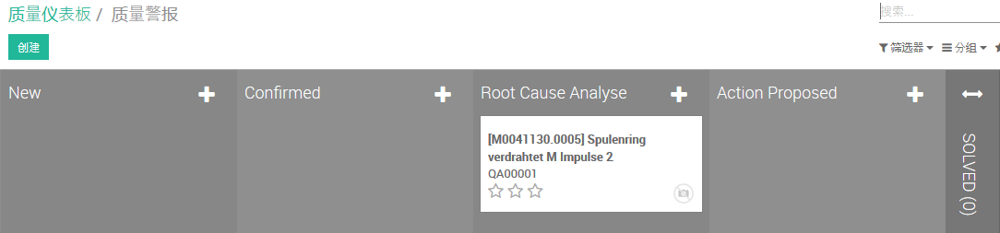

## 质量控制点

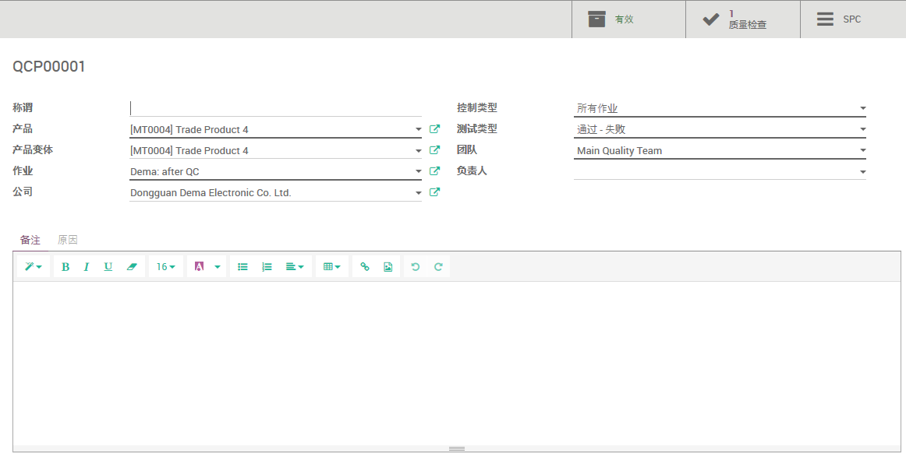

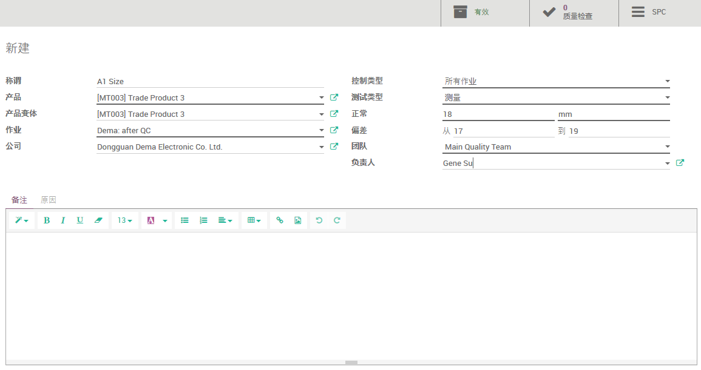

## 质量检查

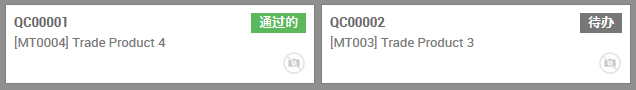

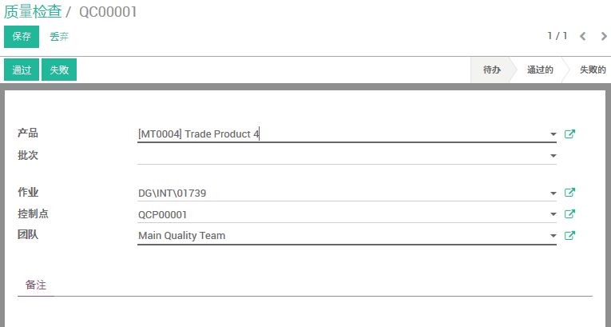

* 对于“通过-失败”类型的质量检查，只需报告检查结果：`通过`或`失败`。
* 若有必要，可以填写`备注`。

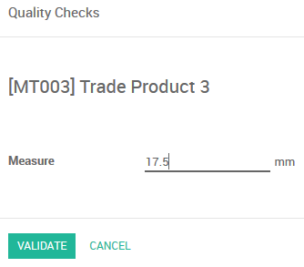

## 质量警报

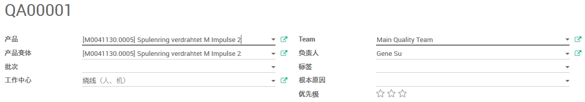

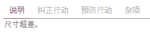

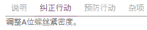

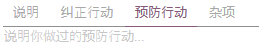

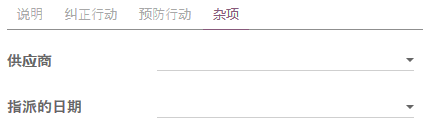