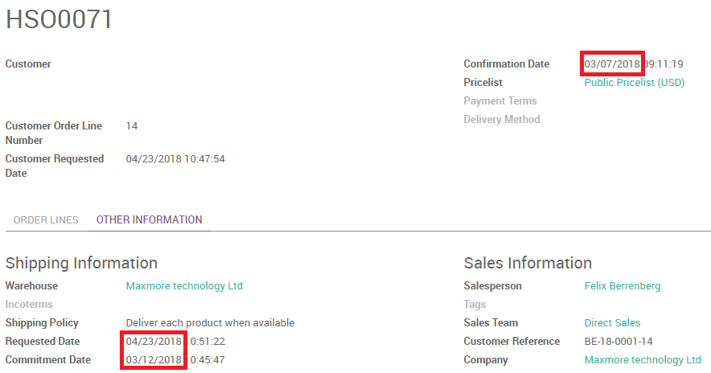
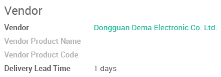
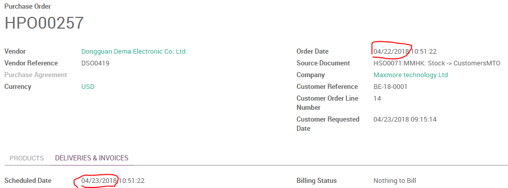
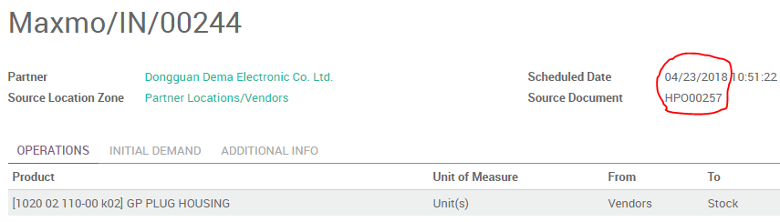
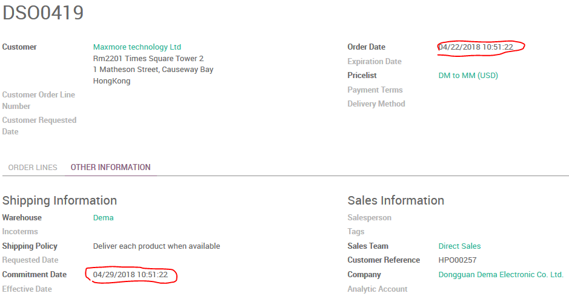

# 多公司环境前置期

* *客户提前期在多公司间共享*
* *供应商提前期跟报价一起，不在多公司间共享*



香港公司 `2018-03-07` 确认销售单，手动指定计划日期 `2018-04-23`。



香港公司设定供应商(大陆公司)前置期为1天。



```
销售交货日期 - 公司的采购提前期 - 供应商交货提前期 = 采购订单日期
2018-04-23 - 0 - 1 = 2018-04-22
```



```
采购订单日期 + 供应商交货提前期 = 入库单的计划日期
2018-04-22 + 1 = 2018-04-23
```



```
大陆公司销售订单日期 = 香港公司采购订单日期
2018-04-22 = 2018-04-22

大陆公司销售订单日期 = 大陆公司销售承诺日期 + 客户前置期
2018-04-22 + 7 = 2018-04-29
```