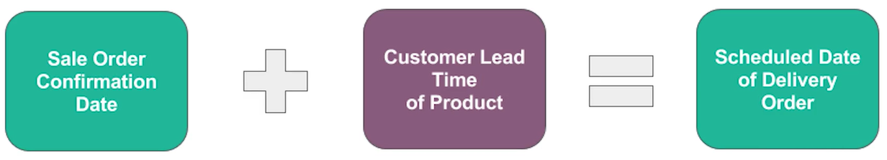
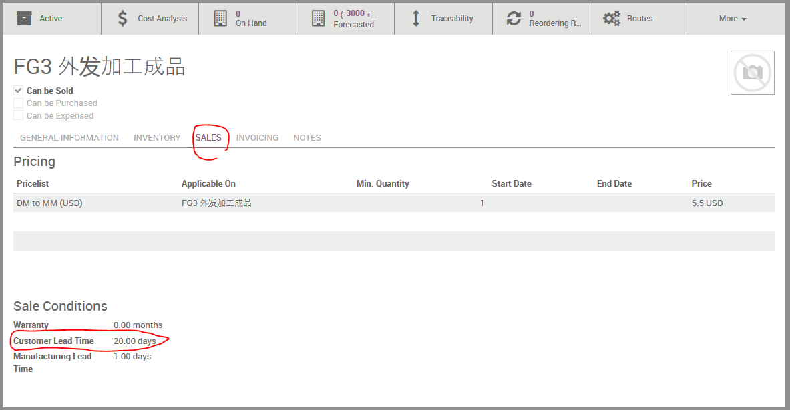
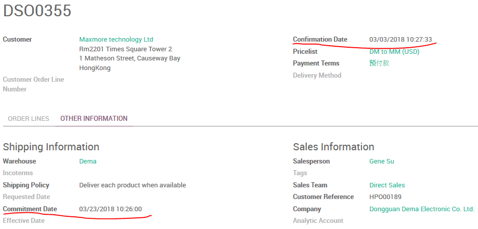
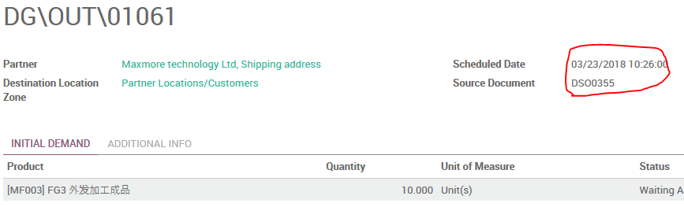
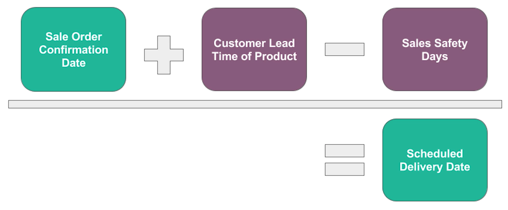
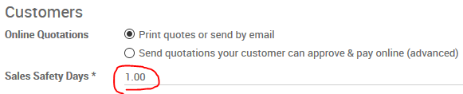
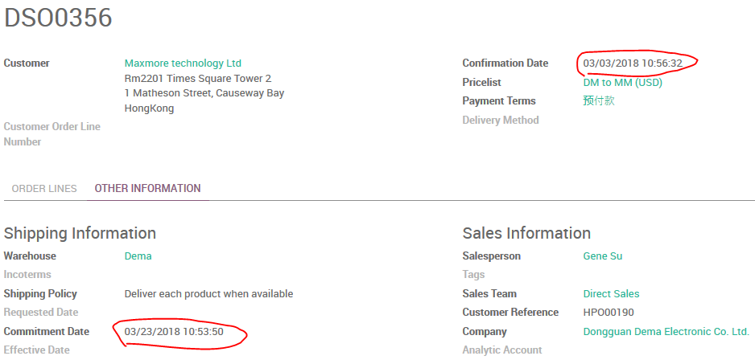
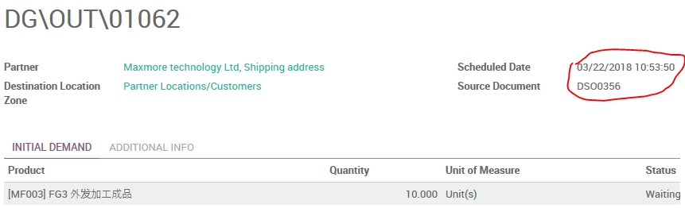

# Delivery Lead Time 递送前置期

*客服人员必须具备一定的英语语言能力，所以本文档以英文为主。*

## Customer Lead Time 客户交付时间

The duration from customers confirm the order to the products are delivered to them.
从客户确认购买产品到产品可以交付给客户所需要的时间。

You can set **Customer Lead Time** at product (SALES TAB).

When the SO is confirmed, the **Commitment Date** will be set to Confirmation Date plus Customer Lead Time.

`2018-03-03 + 20 = 2018-03-23`

And also **Scheduled Date** on Delivery Order will be set to **Confirmation Date** plus **Customer Lead Time**.

`2018-03-03 + 20 = 2018-03-23`

## Sales Safety Days 销售保障时长

The product plan should reserve sufficient time for the purchase and delivery process of the product before the date of commitment to the customer's commitment date. To help deal with the unexpected delay in the supply chain.
对客户承诺日期的误差范围时间，产品计划应该在承诺交付日期前为产品的采购和交付过程预留足够的时间。以帮助处理供应链发生不可预期的延迟情况。

**Sales Safety Days** can be set at [Seles -> Configuration -> Settings].

When the SO is confirmed, the **Commitment Date** will be set to Confirmation Date plus Customer Lead Time.

`2018-03-03 + 20 = 2018-03-23`

And also **Scheduled Date** on Delivery Order will be set to **Confirmation Date** plus **Customer Lead Time** minus **Sales Safety Days**.

`2018-03-03 + 20 - 1 = 2018-03-22`
